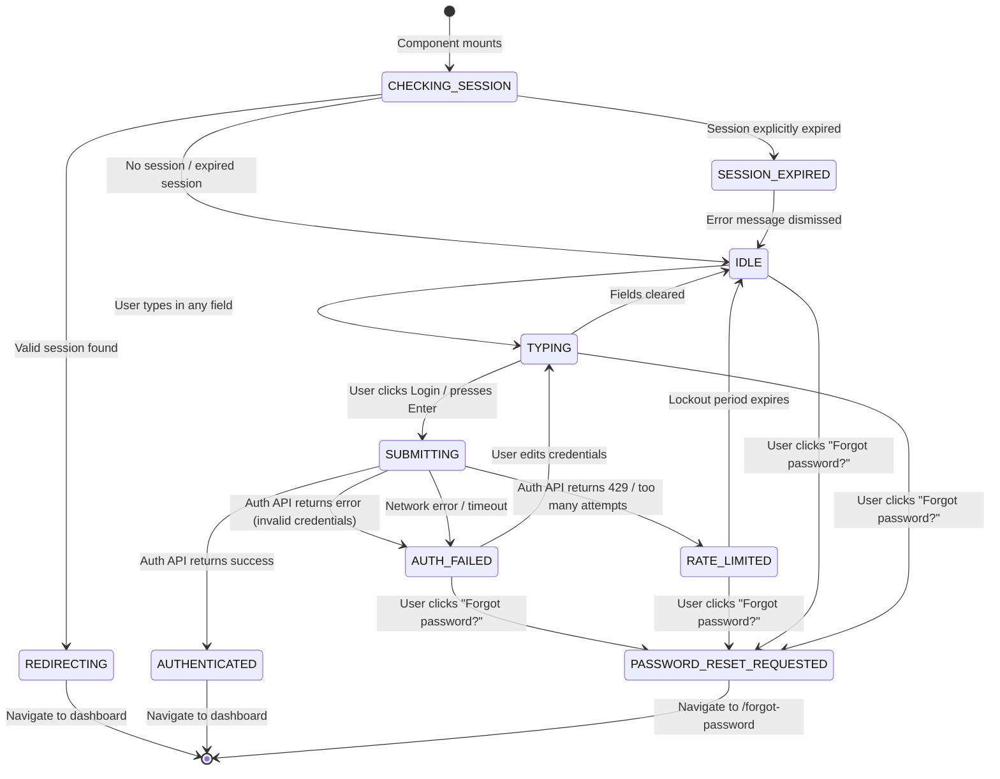

# State Machine — Login Screen

## States

| State | Description |
|---|---|
| `IDLE` | Form visible, no user interaction yet |
| `TYPING` | User is entering credentials |
| `SUBMITTING` | Credentials submitted, awaiting auth response |
| `AUTHENTICATED` | Auth succeeded — transition to dashboard |
| `AUTH_FAILED` | Credentials rejected — error displayed |
| `RATE_LIMITED` | Too many failed attempts — form temporarily locked |
| `PASSWORD_RESET_REQUESTED` | User clicked "Forgot password?" — navigating to reset flow |
| `PASSWORD_RESET_EMAIL_SENT` | Reset email dispatched — confirmation shown |
| `SESSION_EXPIRED` | User arrived at login due to expired session |
| `REDIRECTING` | Session valid on mount — redirecting authenticated user away |

---

## State Transition Diagram

---

## State Details

### CHECKING_SESSION

| Field | Value |
|---|---|
| Trigger | Component mount |
| Actions | Read auth context / session store |
| Duration | Near-instant |
| UI | May show brief loading skeleton or nothing |
| Transitions | → `REDIRECTING` if session valid; → `IDLE` if no session; → `SESSION_EXPIRED` if token expired |

---

### REDIRECTING

| Field | Value |
|---|---|
| Trigger | Valid session detected on mount |
| Actions | `router.replace('/dashboard')` or equivalent |
| UI | Transparent (user should not see login form) |
| Transitions | → Dashboard |

---

### IDLE

| Field | Value |
|---|---|
| Trigger | No session, no user interaction |
| Actions | None |
| UI | Form fields empty, button enabled, no errors visible |
| Transitions | → `TYPING` on any input change; → `PASSWORD_RESET_REQUESTED` on link click |

---

### TYPING

| Field | Value |
|---|---|
| Trigger | User types in email or password field |
| Actions | Update controlled form state |
| UI | Form fields reflect input; any prior error may be cleared on change |
| Transitions | → `SUBMITTING` on form submit; → `PASSWORD_RESET_REQUESTED` on link click |

---

### SUBMITTING

| Field | Value |
|---|---|
| Trigger | Form submit with non-empty fields |
| Actions | Call auth API (Supabase `signInWithPassword`) |
| UI | Login button shows loading state (spinner / disabled); form fields locked |
| Transitions | → `AUTHENTICATED` on success; → `AUTH_FAILED` on error; → `RATE_LIMITED` on 429 |

---

### AUTHENTICATED

| Field | Value |
|---|---|
| Trigger | Auth API returns valid session |
| Actions | Store session token; navigate to dashboard |
| UI | Brief success flash (optional) or immediate redirect |
| Transitions | → Dashboard |

---

### AUTH_FAILED

| Field | Value |
|---|---|
| Trigger | Auth API returns 400/401 or credential mismatch |
| Actions | Display generic error: "Invalid email or password." |
| UI | Error message visible; form fields re-enabled; button re-enabled |
| Transitions | → `TYPING` on input change; → `PASSWORD_RESET_REQUESTED` on link click |

---

### RATE_LIMITED

| Field | Value |
|---|---|
| Trigger | Auth API returns 429 or Supabase auth lockout |
| Actions | Display lockout message with countdown |
| UI | Form may be disabled; countdown timer visible |
| Transitions | → `IDLE` when lockout expires |

---

### PASSWORD_RESET_REQUESTED

| Field | Value |
|---|---|
| Trigger | User clicks "Forgot password?" link |
| Actions | Navigate to `/forgot-password` |
| UI | Transition away from login screen |
| Transitions | → `/forgot-password` route |

---

### SESSION_EXPIRED

| Field | Value |
|---|---|
| Trigger | User arrives at `/login` with an expired session cookie/token |
| Actions | Clear expired session; display expiry notice |
| UI | Banner: "Your session has expired. Please log in again." |
| Transitions | → `IDLE` on dismissal |

---

## Form Validation Rules

| Field | Rule | Error Message |
|---|---|---|
| Email | Required | "Email is required." |
| Email | Valid format | "Please enter a valid email address." |
| Password | Required | "Password is required." |
| Password | Minimum length | Not shown pre-submit (risk: user enumeration) |

**Note:** Pre-submit validation (inline as user types) should be gentle — avoid showing "password too short" before the user has finished typing, as this can frustrate UX and reveal password policy for attackers.
