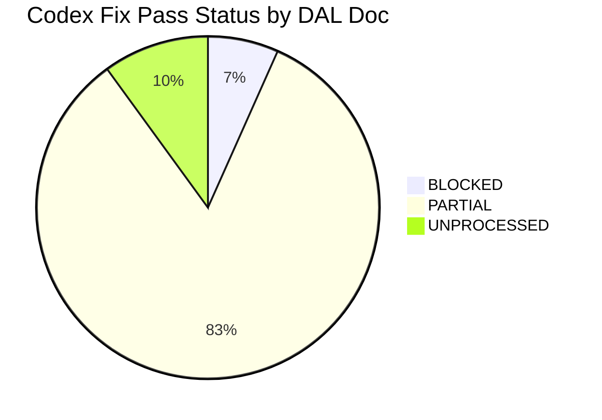

# VCSM DAL Documentation Graph

_Generated:_ 2026-05-11  
_Scope:_ `/Users/vcsm/Desktop/VCSM/zNOTFORPRODUCTION/_CANONICAL/logan/vcsm/dal`  
_Source files:_ 30 DAL Markdown documents.

## Status Overview



## DAL Doc Status Graph

```mermaid
flowchart LR
  ROOT["VCSM DAL Docs"]
  status_BLOCKED["BLOCKED (2)"]
  ROOT --> status_BLOCKED
  status_PARTIAL["PARTIAL (25)"]
  ROOT --> status_PARTIAL
  status_UNPROCESSED["UNPROCESSED (3)"]
  ROOT --> status_UNPROCESSED
  actors["actors<br/>risks:9 dal:0"]:::partial
  status_PARTIAL --> actors
  ads["ads<br/>risks:5 dal:1"]:::partial
  status_PARTIAL --> ads
  auth["auth<br/>risks:0 dal:11"]:::partial
  status_PARTIAL --> auth
  block["block<br/>risks:8 dal:0"]:::partial
  status_PARTIAL --> block
  booking["booking<br/>risks:8 dal:20"]:::partial
  status_PARTIAL --> booking
  chat["chat<br/>risks:7 dal:2"]:::partial
  status_PARTIAL --> chat
  dashboard["dashboard<br/>risks:0 dal:30"]:::partial
  status_PARTIAL --> dashboard
  explore["explore<br/>risks:7 dal:1"]:::partial
  status_PARTIAL --> explore
  feed["feed<br/>risks:0 dal:16"]:::partial
  status_PARTIAL --> feed
  identity["identity<br/>risks:9 dal:2"]:::partial
  status_PARTIAL --> identity
  index["index<br/>risks:8 dal:0"]:::partial
  status_PARTIAL --> index
  invite["invite<br/>risks:9 dal:1"]:::partial
  status_PARTIAL --> invite
  join["join<br/>risks:0 dal:3"]:::partial
  status_PARTIAL --> join
  learning["learning<br/>risks:6 dal:33"]:::unprocessed
  status_UNPROCESSED --> learning
  legal["legal<br/>risks:0 dal:4"]:::partial
  status_PARTIAL --> legal
  media["media<br/>risks:2 dal:2"]:::partial
  status_PARTIAL --> media
  moderation["moderation<br/>risks:0 dal:6"]:::partial
  status_PARTIAL --> moderation
  notifications["notifications<br/>risks:16 dal:3"]:::partial
  status_PARTIAL --> notifications
  onboarding["onboarding<br/>risks:0 dal:4"]:::blocked
  status_BLOCKED --> onboarding
  post["post<br/>risks:5 dal:12"]:::partial
  status_PARTIAL --> post
  professional["professional<br/>risks:0 dal:1"]:::partial
  status_PARTIAL --> professional
  profiles["profiles<br/>risks:8 dal:73"]:::partial
  status_PARTIAL --> profiles
  public["public<br/>risks:0 dal:11"]:::partial
  status_PARTIAL --> public
  settings["settings<br/>risks:0 dal:15"]:::partial
  status_PARTIAL --> settings
  social["social<br/>risks:5 dal:4"]:::partial
  status_PARTIAL --> social
  state["state<br/>risks:0 dal:1"]:::blocked
  status_BLOCKED --> state
  upload["upload<br/>risks:0 dal:8"]:::partial
  status_PARTIAL --> upload
  vport["vport<br/>risks:10 dal:4"]:::partial
  status_PARTIAL --> vport
  wanderex["wanderex<br/>risks:0 dal:2"]:::unprocessed
  status_UNPROCESSED --> wanderex
  wanders["wanders<br/>risks:0 dal:19"]:::unprocessed
  status_UNPROCESSED --> wanders
  classDef done fill:#dcfce7,stroke:#15803d,color:#052e16
  classDef partial fill:#fef9c3,stroke:#a16207,color:#422006
  classDef blocked fill:#fee2e2,stroke:#b91c1c,color:#450a0a
  classDef unprocessed fill:#e5e7eb,stroke:#374151,color:#111827
```



## Finding Status Totals

| Finding Status | Count |
|---|---:|
| DEFERRED | 74 |
| DONE | 58 |
| BLOCKED | 30 |
| DOCUMENTED | 22 |
| VERIFIED | 6 |
| PARTIAL | 5 |
| DOCUMENTED CURRENT STATE | 3 |
| DOCUMENTED IN CODE | 2 |
| VERIFIED LIVE | 2 |
| ALREADY FIXED | 1 |
| DOCUMENTED FALSE POSITIVE | 1 |
| FALSE POSITIVE | 1 |
| FIXED | 1 |
| NO ACTION | 1 |
| OUT OF SCOPE | 1 |
| RESOLVED IN CURRENT TREE | 1 |
| VERIFIED CLEAN | 1 |
| VERIFIED FEATURE-FLAGGED | 1 |
| VERIFIED KEEP | 1 |

## Review Handoff Graph

```mermaid
flowchart LR
  ARCHITECT["ARCHITECT<br/>30 docs"]:::agent
  LOGAN["LOGAN<br/>30 docs"]:::agent
  IRONMAN["IRONMAN<br/>29 docs"]:::agent
  SENTRY["SENTRY<br/>29 docs"]:::agent
  VENOM["VENOM<br/>28 docs"]:::agent
  CARNAGE["CARNAGE<br/>22 docs"]:::agent
  LOKI["LOKI<br/>21 docs"]:::agent
  FALCON["FALCON<br/>20 docs"]:::agent
  SHIELD["SHIELD<br/>20 docs"]:::agent
  KRAVEN["KRAVEN<br/>18 docs"]:::agent
  WINTER_SOLDIER["WINTER SOLDIER<br/>18 docs"]:::agent
  WOLVERINE["WOLVERINE<br/>8 docs"]:::agent
  actors --> ARCHITECT
  actors --> CARNAGE
  actors --> FALCON
  actors --> IRONMAN
  actors --> KRAVEN
  actors --> LOGAN
  actors --> LOKI
  actors --> SENTRY
  actors --> SHIELD
  actors --> VENOM
  actors --> WINTER_SOLDIER
  actors --> WOLVERINE
  ads --> ARCHITECT
  ads --> CARNAGE
  ads --> FALCON
  ads --> IRONMAN
  ads --> KRAVEN
  ads --> LOGAN
  ads --> LOKI
  ads --> SENTRY
  ads --> SHIELD
  ads --> VENOM
  ads --> WINTER_SOLDIER
  auth --> ARCHITECT
  auth --> CARNAGE
  auth --> FALCON
  auth --> IRONMAN
  auth --> KRAVEN
  auth --> LOGAN
  auth --> LOKI
  auth --> SENTRY
  auth --> SHIELD
  auth --> VENOM
  auth --> WINTER_SOLDIER
  auth --> WOLVERINE
  block --> ARCHITECT
  block --> CARNAGE
  block --> FALCON
  block --> IRONMAN
  block --> KRAVEN
  block --> LOGAN
  block --> LOKI
  block --> SENTRY
  block --> SHIELD
  block --> VENOM
  block --> WINTER_SOLDIER
  booking --> ARCHITECT
  booking --> CARNAGE
  booking --> IRONMAN
  booking --> LOGAN
  booking --> LOKI
  booking --> SENTRY
  booking --> SHIELD
  booking --> VENOM
  chat --> ARCHITECT
  chat --> CARNAGE
  chat --> FALCON
  chat --> IRONMAN
  chat --> KRAVEN
  chat --> LOGAN
  chat --> LOKI
  chat --> SENTRY
  chat --> SHIELD
  chat --> VENOM
  chat --> WINTER_SOLDIER
  dashboard --> ARCHITECT
  dashboard --> CARNAGE
  dashboard --> FALCON
  dashboard --> IRONMAN
  dashboard --> KRAVEN
  dashboard --> LOGAN
  dashboard --> LOKI
  dashboard --> SENTRY
  dashboard --> SHIELD
  dashboard --> VENOM
  dashboard --> WINTER_SOLDIER
  explore --> ARCHITECT
  explore --> IRONMAN
  explore --> KRAVEN
  explore --> LOGAN
  explore --> LOKI
  explore --> SENTRY
  explore --> SHIELD
  explore --> VENOM
  feed --> ARCHITECT
  feed --> CARNAGE
  feed --> FALCON
  feed --> IRONMAN
  feed --> KRAVEN
  feed --> LOGAN
  feed --> LOKI
  feed --> SENTRY
  feed --> SHIELD
  feed --> VENOM
  feed --> WINTER_SOLDIER
  feed --> WOLVERINE
  identity --> ARCHITECT
  identity --> CARNAGE
  identity --> FALCON
  identity --> IRONMAN
  identity --> KRAVEN
  identity --> LOGAN
  identity --> LOKI
  identity --> SENTRY
  identity --> SHIELD
  identity --> VENOM
  identity --> WINTER_SOLDIER
  index --> ARCHITECT
  index --> CARNAGE
  index --> FALCON
  index --> IRONMAN
  index --> KRAVEN
  index --> LOGAN
  index --> LOKI
  index --> SENTRY
  index --> SHIELD
  index --> VENOM
  index --> WINTER_SOLDIER
  invite --> ARCHITECT
  invite --> CARNAGE
  invite --> FALCON
  invite --> IRONMAN
  invite --> KRAVEN
  invite --> LOGAN
  invite --> LOKI
  invite --> SENTRY
  invite --> SHIELD
  invite --> VENOM
  invite --> WINTER_SOLDIER
  join --> ARCHITECT
  join --> CARNAGE
  join --> IRONMAN
  join --> LOGAN
  join --> SENTRY
  join --> SHIELD
  join --> VENOM
  join --> WOLVERINE
  learning --> ARCHITECT
  learning --> CARNAGE
  learning --> FALCON
  learning --> IRONMAN
  learning --> KRAVEN
  learning --> LOGAN
  learning --> LOKI
  learning --> SENTRY
  learning --> SHIELD
  learning --> VENOM
  learning --> WINTER_SOLDIER
  legal --> ARCHITECT
  legal --> CARNAGE
  legal --> FALCON
  legal --> IRONMAN
  legal --> KRAVEN
  legal --> LOGAN
  legal --> LOKI
  legal --> SENTRY
  legal --> SHIELD
  legal --> VENOM
  legal --> WINTER_SOLDIER
  media --> ARCHITECT
  media --> CARNAGE
  media --> FALCON
  media --> IRONMAN
  media --> KRAVEN
  media --> LOGAN
  media --> LOKI
  media --> SENTRY
  media --> SHIELD
  media --> VENOM
  media --> WINTER_SOLDIER
  moderation --> ARCHITECT
  moderation --> CARNAGE
  moderation --> FALCON
  moderation --> IRONMAN
  moderation --> LOGAN
  moderation --> LOKI
  moderation --> SENTRY
  moderation --> SHIELD
  moderation --> VENOM
  moderation --> WINTER_SOLDIER
  notifications --> ARCHITECT
  notifications --> CARNAGE
  notifications --> FALCON
  notifications --> IRONMAN
  notifications --> KRAVEN
  notifications --> LOGAN
  notifications --> LOKI
  notifications --> SENTRY
  notifications --> SHIELD
  notifications --> VENOM
  notifications --> WINTER_SOLDIER
  onboarding --> ARCHITECT
  onboarding --> CARNAGE
  onboarding --> FALCON
  onboarding --> IRONMAN
  onboarding --> KRAVEN
  onboarding --> LOGAN
  onboarding --> LOKI
  onboarding --> SENTRY
  onboarding --> SHIELD
  onboarding --> VENOM
  onboarding --> WINTER_SOLDIER
  onboarding --> WOLVERINE
  post --> ARCHITECT
  post --> IRONMAN
  post --> LOGAN
  post --> SENTRY
  post --> SHIELD
  post --> VENOM
  professional --> ARCHITECT
  professional --> IRONMAN
  professional --> LOGAN
  professional --> VENOM
  professional --> WOLVERINE
  profiles --> ARCHITECT
  profiles --> IRONMAN
  profiles --> LOGAN
  profiles --> LOKI
  profiles --> SENTRY
  profiles --> VENOM
  public --> ARCHITECT
  public --> CARNAGE
  public --> FALCON
  public --> IRONMAN
  public --> KRAVEN
  public --> LOGAN
  public --> LOKI
  public --> SENTRY
  public --> VENOM
  public --> WINTER_SOLDIER
  settings --> ARCHITECT
  settings --> IRONMAN
  settings --> LOGAN
  settings --> SENTRY
  settings --> VENOM
  social --> ARCHITECT
  social --> FALCON
  social --> IRONMAN
  social --> LOGAN
  social --> SENTRY
  social --> VENOM
  state --> ARCHITECT
  state --> CARNAGE
  state --> IRONMAN
  state --> LOGAN
  state --> SENTRY
  state --> VENOM
  upload --> ARCHITECT
  upload --> CARNAGE
  upload --> FALCON
  upload --> IRONMAN
  upload --> KRAVEN
  upload --> LOGAN
  upload --> LOKI
  upload --> SENTRY
  upload --> VENOM
  upload --> WINTER_SOLDIER
  vport --> ARCHITECT
  vport --> LOGAN
  vport --> SENTRY
  vport --> WOLVERINE
  wanderex --> ARCHITECT
  wanderex --> IRONMAN
  wanderex --> LOGAN
  wanderex --> SENTRY
  wanderex --> WOLVERINE
  wanders --> ARCHITECT
  wanders --> CARNAGE
  wanders --> FALCON
  wanders --> IRONMAN
  wanders --> LOGAN
  wanders --> SENTRY
  wanders --> VENOM
  classDef agent fill:#dbeafe,stroke:#1d4ed8,color:#172554
```



## Risk Density

| DAL Doc | Status | DAL Files Documented | Unique Risk IDs | Dead Mentions | Boundary Mentions | Duplicate Mentions | Drift Mentions | Review Mentions |
|---|---|---:|---:|---:|---:|---:|---:|---|
| `vcsm.dal.notifications.md` | PARTIAL | 3 | 16 | 37 | 57 | 2 | 28 | SENTRY, IRONMAN, VENOM, LOGAN, ARCHITECT, CARNAGE, KRAVEN, FALCON, WINTER SOLDIER, LOKI, SHIELD |
| `vcsm.dal.vport.md` | PARTIAL | 4 | 10 | 16 | 91 | 9 | 1 | SENTRY, LOGAN, ARCHITECT, WOLVERINE |
| `vcsm.dal.actors.md` | PARTIAL | 0 | 9 | 8 | 97 | 18 | 25 | SENTRY, IRONMAN, VENOM, LOGAN, ARCHITECT, CARNAGE, KRAVEN, FALCON, WINTER SOLDIER, LOKI, SHIELD, WOLVERINE |
| `vcsm.dal.identity.md` | PARTIAL | 2 | 9 | 24 | 83 | 2 | 19 | SENTRY, IRONMAN, VENOM, LOGAN, ARCHITECT, CARNAGE, KRAVEN, FALCON, WINTER SOLDIER, LOKI, SHIELD |
| `vcsm.dal.invite.md` | PARTIAL | 1 | 9 | 23 | 28 | 0 | 19 | SENTRY, IRONMAN, VENOM, LOGAN, ARCHITECT, CARNAGE, KRAVEN, FALCON, WINTER SOLDIER, LOKI, SHIELD |
| `vcsm.dal.block.md` | PARTIAL | 0 | 8 | 38 | 100 | 20 | 46 | SENTRY, IRONMAN, VENOM, LOGAN, ARCHITECT, CARNAGE, KRAVEN, FALCON, WINTER SOLDIER, LOKI, SHIELD |
| `vcsm.dal.booking.md` | PARTIAL | 20 | 8 | 9 | 94 | 12 | 13 | SENTRY, IRONMAN, VENOM, LOGAN, ARCHITECT, CARNAGE, LOKI, SHIELD |
| `vcsm.dal.index.md` | PARTIAL | 0 | 8 | 8 | 51 | 11 | 35 | SENTRY, IRONMAN, VENOM, LOGAN, ARCHITECT, CARNAGE, KRAVEN, FALCON, WINTER SOLDIER, LOKI, SHIELD |
| `vcsm.dal.profiles.md` | PARTIAL | 73 | 8 | 56 | 112 | 18 | 3 | SENTRY, IRONMAN, VENOM, LOGAN, ARCHITECT, LOKI |
| `vcsm.dal.chat.md` | PARTIAL | 2 | 7 | 7 | 62 | 1 | 24 | SENTRY, IRONMAN, VENOM, LOGAN, ARCHITECT, CARNAGE, KRAVEN, FALCON, WINTER SOLDIER, LOKI, SHIELD |
| `vcsm.dal.explore.md` | PARTIAL | 1 | 7 | 18 | 5 | 18 | 11 | SENTRY, IRONMAN, VENOM, LOGAN, ARCHITECT, KRAVEN, LOKI, SHIELD |
| `vcsm.dal.learning.md` | UNPROCESSED | 33 | 6 | 5 | 52 | 9 | 23 | SENTRY, IRONMAN, VENOM, LOGAN, ARCHITECT, CARNAGE, KRAVEN, FALCON, WINTER SOLDIER, LOKI, SHIELD |
| `vcsm.dal.ads.md` | PARTIAL | 1 | 5 | 2 | 22 | 0 | 13 | SENTRY, IRONMAN, VENOM, LOGAN, ARCHITECT, CARNAGE, KRAVEN, FALCON, WINTER SOLDIER, LOKI, SHIELD |
| `vcsm.dal.post.md` | PARTIAL | 12 | 5 | 24 | 130 | 3 | 18 | SENTRY, IRONMAN, VENOM, LOGAN, ARCHITECT, SHIELD |
| `vcsm.dal.social.md` | PARTIAL | 4 | 5 | 15 | 132 | 18 | 22 | SENTRY, IRONMAN, VENOM, LOGAN, ARCHITECT, FALCON |
| `vcsm.dal.media.md` | PARTIAL | 2 | 2 | 4 | 90 | 0 | 32 | SENTRY, IRONMAN, VENOM, LOGAN, ARCHITECT, CARNAGE, KRAVEN, FALCON, WINTER SOLDIER, LOKI, SHIELD |
| `vcsm.dal.auth.md` | PARTIAL | 11 | 0 | 10 | 62 | 0 | 25 | SENTRY, IRONMAN, VENOM, LOGAN, ARCHITECT, CARNAGE, KRAVEN, FALCON, WINTER SOLDIER, LOKI, SHIELD, WOLVERINE |
| `vcsm.dal.dashboard.md` | PARTIAL | 30 | 0 | 38 | 81 | 4 | 10 | SENTRY, IRONMAN, VENOM, LOGAN, ARCHITECT, CARNAGE, KRAVEN, FALCON, WINTER SOLDIER, LOKI, SHIELD |
| `vcsm.dal.feed.md` | PARTIAL | 16 | 0 | 22 | 65 | 1 | 21 | SENTRY, IRONMAN, VENOM, LOGAN, ARCHITECT, CARNAGE, KRAVEN, FALCON, WINTER SOLDIER, LOKI, SHIELD, WOLVERINE |
| `vcsm.dal.join.md` | PARTIAL | 3 | 0 | 7 | 57 | 0 | 10 | SENTRY, IRONMAN, VENOM, LOGAN, ARCHITECT, CARNAGE, SHIELD, WOLVERINE |
| `vcsm.dal.legal.md` | PARTIAL | 4 | 0 | 18 | 37 | 0 | 20 | SENTRY, IRONMAN, VENOM, LOGAN, ARCHITECT, CARNAGE, KRAVEN, FALCON, WINTER SOLDIER, LOKI, SHIELD |
| `vcsm.dal.moderation.md` | PARTIAL | 6 | 0 | 141 | 139 | 0 | 9 | SENTRY, IRONMAN, VENOM, LOGAN, ARCHITECT, CARNAGE, FALCON, WINTER SOLDIER, LOKI, SHIELD |
| `vcsm.dal.onboarding.md` | BLOCKED | 4 | 0 | 29 | 27 | 0 | 29 | SENTRY, IRONMAN, VENOM, LOGAN, ARCHITECT, CARNAGE, KRAVEN, FALCON, WINTER SOLDIER, LOKI, SHIELD, WOLVERINE |
| `vcsm.dal.professional.md` | PARTIAL | 1 | 0 | 26 | 14 | 0 | 0 | IRONMAN, VENOM, LOGAN, ARCHITECT, WOLVERINE |
| `vcsm.dal.public.md` | PARTIAL | 11 | 0 | 20 | 24 | 0 | 10 | SENTRY, IRONMAN, VENOM, LOGAN, ARCHITECT, CARNAGE, KRAVEN, FALCON, WINTER SOLDIER, LOKI |
| `vcsm.dal.settings.md` | PARTIAL | 15 | 0 | 6 | 47 | 15 | 0 | SENTRY, IRONMAN, VENOM, LOGAN, ARCHITECT |
| `vcsm.dal.state.md` | BLOCKED | 1 | 0 | 6 | 28 | 2 | 1 | SENTRY, IRONMAN, VENOM, LOGAN, ARCHITECT, CARNAGE |
| `vcsm.dal.upload.md` | PARTIAL | 8 | 0 | 12 | 40 | 2 | 2 | SENTRY, IRONMAN, VENOM, LOGAN, ARCHITECT, CARNAGE, KRAVEN, FALCON, WINTER SOLDIER, LOKI |
| `vcsm.dal.wanderex.md` | UNPROCESSED | 2 | 0 | 8 | 11 | 7 | 0 | SENTRY, IRONMAN, LOGAN, ARCHITECT, WOLVERINE |
| `vcsm.dal.wanders.md` | UNPROCESSED | 19 | 0 | 79 | 9 | 8 | 5 | SENTRY, IRONMAN, VENOM, LOGAN, ARCHITECT, CARNAGE, FALCON |

## Tables Accessed Map

```mermaid
flowchart LR
  notifications["notifications"]:::doc
  tbl_actors["actors"]:::table
  notifications --> tbl_actors
  tbl_listActorIdentityRowsByIdsDAL["listActorIdentityRowsByIdsDAL"]:::table
  notifications --> tbl_listActorIdentityRowsByIdsDAL
  tbl_listActorPresentationRowsByIdsDAL["listActorPresentationRowsByIdsDAL"]:::table
  notifications --> tbl_listActorPresentationRowsByIdsDAL
  tbl_listActorSummaryRowsByIdsDAL["listActorSummaryRowsByIdsDAL"]:::table
  notifications --> tbl_listActorSummaryRowsByIdsDAL
  tbl_listProfileRowsByIdsDAL["listProfileRowsByIdsDAL"]:::table
  notifications --> tbl_listProfileRowsByIdsDAL
  tbl_listVportRowsByIdsDAL["listVportRowsByIdsDAL"]:::table
  notifications --> tbl_listVportRowsByIdsDAL
  tbl_blocks["blocks"]:::table
  notifications --> tbl_blocks
  tbl_listBlockedActorRowsDAL["listBlockedActorRowsDAL"]:::table
  notifications --> tbl_listBlockedActorRowsDAL
  tbl_listBlockingActorRowsDAL["listBlockingActorRowsDAL"]:::table
  notifications --> tbl_listBlockingActorRowsDAL
  tbl_events["events"]:::table
  notifications --> tbl_events
  tbl_archiveNotificationDAL["archiveNotificationDAL"]:::table
  notifications --> tbl_archiveNotificationDAL
  tbl_configureNotificationsRuntimeDAL["configureNotificationsRuntimeDAL"]:::table
  notifications --> tbl_configureNotificationsRuntimeDAL
  tbl_countNotificationUnreadInboxItemsDAL["countNotificationUnreadInboxItemsDAL"]:::table
  notifications --> tbl_countNotificationUnreadInboxItemsDAL
  tbl_dismissNotificationDAL["dismissNotificationDAL"]:::table
  notifications --> tbl_dismissNotificationDAL
  tbl_insertNotificationEventDAL["insertNotificationEventDAL"]:::table
  notifications --> tbl_insertNotificationEventDAL
  tbl_insertNotificationInboxItemDAL["insertNotificationInboxItemDAL"]:::table
  notifications --> tbl_insertNotificationInboxItemDAL
  tbl_insertNotificationRecipientsDAL["insertNotificationRecipientsDAL"]:::table
  notifications --> tbl_insertNotificationRecipientsDAL
  tbl_markNotificationReadDAL["markNotificationReadDAL"]:::table
  notifications --> tbl_markNotificationReadDAL
  tbl_markNotificationRecipientsSeenDAL["markNotificationRecipientsSeenDAL"]:::table
  notifications --> tbl_markNotificationRecipientsSeenDAL
  tbl_readNotificationEventsByIdsDAL["readNotificationEventsByIdsDAL"]:::table
  notifications --> tbl_readNotificationEventsByIdsDAL
  vport["vport"]:::doc
  tbl_profiles["profiles"]:::table
  vport --> tbl_profiles
  tbl_createVport["createVport"]:::table
  vport --> tbl_createVport
  tbl_getVportById["getVportById"]:::table
  vport --> tbl_getVportById
  tbl_getVportBySlug["getVportBySlug"]:::table
  vport --> tbl_getVportBySlug
  tbl_getVportsByIds["getVportsByIds"]:::table
  vport --> tbl_getVportsByIds
  tbl_hardDeleteVport["hardDeleteVport"]:::table
  vport --> tbl_hardDeleteVport
  tbl_listMyVports["listMyVports"]:::table
  vport --> tbl_listMyVports
  tbl_restoreVport["restoreVport"]:::table
  vport --> tbl_restoreVport
  tbl_softDeleteVport["softDeleteVport"]:::table
  vport --> tbl_softDeleteVport
  tbl_updateVportAvatarMediaAssetIdDAL["updateVportAvatarMediaAssetIdDAL"]:::table
  vport --> tbl_updateVportAvatarMediaAssetIdDAL
  tbl_updateVportBannerMediaAssetIdDAL["updateVportBannerMediaAssetIdDAL"]:::table
  vport --> tbl_updateVportBannerMediaAssetIdDAL
  tbl_updateVport["updateVport"]:::table
  vport --> tbl_updateVport
  tbl_service_catalog["service_catalog"]:::table
  vport --> tbl_service_catalog
  tbl_readVportServiceCatalogByTypeDAL["readVportServiceCatalogByTypeDAL"]:::table
  vport --> tbl_readVportServiceCatalogByTypeDAL
  booking["booking"]:::doc
  tbl_actor_owners["actor_owners"]:::table
  booking --> tbl_actor_owners
  tbl_readActorOwnerLinkByActorAndUserProfileDAL["readActorOwnerLinkByActorAndUserProfileDAL"]:::table
  booking --> tbl_readActorOwnerLinkByActorAndUserProfileDAL
  tbl_actors["actors"]:::table
  booking --> tbl_actors
  tbl_getActorByIdDAL["getActorByIdDAL"]:::table
  booking --> tbl_getActorByIdDAL
  tbl_availability_exceptions["availability_exceptions"]:::table
  booking --> tbl_availability_exceptions
  tbl_listAvailabilityExceptionsInRangeDAL["listAvailabilityExceptionsInRangeDAL"]:::table
  booking --> tbl_listAvailabilityExceptionsInRangeDAL
  tbl_upsertAvailabilityExceptionDAL["upsertAvailabilityExceptionDAL"]:::table
  booking --> tbl_upsertAvailabilityExceptionDAL
  tbl_availability_rules["availability_rules"]:::table
  booking --> tbl_availability_rules
  tbl_listAvailabilityRulesByResourceIdDAL["listAvailabilityRulesByResourceIdDAL"]:::table
  booking --> tbl_listAvailabilityRulesByResourceIdDAL
  tbl_upsertAvailabilityRuleDAL["upsertAvailabilityRuleDAL"]:::table
  booking --> tbl_upsertAvailabilityRuleDAL
  tbl_bookings["bookings"]:::table
  booking --> tbl_bookings
  tbl_getBookingByIdDAL["getBookingByIdDAL"]:::table
  booking --> tbl_getBookingByIdDAL
  tbl_insertBookingDAL["insertBookingDAL"]:::table
  booking --> tbl_insertBookingDAL
  tbl_listBookingsByCustomerDAL["listBookingsByCustomerDAL"]:::table
  booking --> tbl_listBookingsByCustomerDAL
  tbl_listBookingsByResourceDAL["listBookingsByResourceDAL"]:::table
  booking --> tbl_listBookingsByResourceDAL
  tbl_listBookingsInRangeDAL["listBookingsInRangeDAL"]:::table
  booking --> tbl_listBookingsInRangeDAL
  tbl_updateBookingStatusDAL["updateBookingStatusDAL"]:::table
  booking --> tbl_updateBookingStatusDAL
  tbl_profiles["profiles"]:::table
  booking --> tbl_profiles
  tbl_readVportServicesByActorDAL["readVportServicesByActorDAL"]:::table
  booking --> tbl_readVportServicesByActorDAL
  tbl_resource_services["resource_services"]:::table
  booking --> tbl_resource_services
  profiles["profiles"]:::doc
  tbl_actor_directory["actor_directory"]:::table
  profiles --> tbl_actor_directory
  tbl_invalidateSlugResolutionCache["invalidateSlugResolutionCache"]:::table
  profiles --> tbl_invalidateSlugResolutionCache
  tbl_readActorIdByUsername["readActorIdByUsername"]:::table
  profiles --> tbl_readActorIdByUsername
  tbl_resolveActorBySlugOrUsernameDAL["resolveActorBySlugOrUsernameDAL"]:::table
  profiles --> tbl_resolveActorBySlugOrUsernameDAL
  tbl_actor_follows["actor_follows"]:::table
  profiles --> tbl_actor_follows
  tbl_readFollowStateDAL["readFollowStateDAL"]:::table
  profiles --> tbl_readFollowStateDAL
  tbl_actor_owners["actor_owners"]:::table
  profiles --> tbl_actor_owners
  tbl_checkActorOwnershipDAL["checkActorOwnershipDAL"]:::table
  profiles --> tbl_checkActorOwnershipDAL
  tbl_dalReadActorOwnerRow["dalReadActorOwnerRow"]:::table
  profiles --> tbl_dalReadActorOwnerRow
  tbl_actors["actors"]:::table
  profiles --> tbl_actors
  tbl_dalReadReviewTargetActor["dalReadReviewTargetActor"]:::table
  profiles --> tbl_dalReadReviewTargetActor
  tbl_fetchPostsForActorDAL["fetchPostsForActorDAL"]:::table
  profiles --> tbl_fetchPostsForActorDAL
  tbl_invalidateActorDirectoryCache["invalidateActorDirectoryCache"]:::table
  profiles --> tbl_invalidateActorDirectoryCache
  tbl_invalidateActorProfileCache["invalidateActorProfileCache"]:::table
  profiles --> tbl_invalidateActorProfileCache
  tbl_invalidateActorSeoViewCache["invalidateActorSeoViewCache"]:::table
  profiles --> tbl_invalidateActorSeoViewCache
  tbl_invalidateActorTypeCache["invalidateActorTypeCache"]:::table
  profiles --> tbl_invalidateActorTypeCache
  tbl_invalidateVportCategoryCache["invalidateVportCategoryCache"]:::table
  profiles --> tbl_invalidateVportCategoryCache
  tbl_invalidateVportProfileSeoCache["invalidateVportProfileSeoCache"]:::table
  profiles --> tbl_invalidateVportProfileSeoCache
  tbl_invalidateVportPublicDetailsSeoCache["invalidateVportPublicDetailsSeoCache"]:::table
  profiles --> tbl_invalidateVportPublicDetailsSeoCache
  tbl_readActorDirectoryRowDAL["readActorDirectoryRowDAL"]:::table
  profiles --> tbl_readActorDirectoryRowDAL
  chat["chat"]:::doc
  tbl_inbox_entries["inbox_entries"]:::table
  chat --> tbl_inbox_entries
  tbl_readChatInboxUnreadRowsDAL["readChatInboxUnreadRowsDAL"]:::table
  chat --> tbl_readChatInboxUnreadRowsDAL
  tbl_message_attachments["message_attachments"]:::table
  chat --> tbl_message_attachments
  tbl_updateAttachmentMediaAssetIdDAL["updateAttachmentMediaAssetIdDAL"]:::table
  chat --> tbl_updateAttachmentMediaAssetIdDAL
  explore["explore"]:::doc
  tbl_posts["posts"]:::table
  explore --> tbl_posts
  tbl_vc["vc"]:::table
  explore --> tbl_vc
  tbl_searchPosts["searchPosts"]:::table
  explore --> tbl_searchPosts
  tbl_searchPostsByTag["searchPostsByTag"]:::table
  explore --> tbl_searchPostsByTag
  tbl_search_actor_directory["search_actor_directory"]:::table
  explore --> tbl_search_actor_directory
  tbl_identity["identity"]:::table
  explore --> tbl_identity
  tbl_searchActors["searchActors"]:::table
  explore --> tbl_searchActors
  learning["learning"]:::doc
  tbl_assignment_rubrics["assignment_rubrics"]:::table
  learning --> tbl_assignment_rubrics
  tbl_listAssignmentRubricsByAssignmentIdDal["listAssignmentRubricsByAssignmentIdDal"]:::table
  learning --> tbl_listAssignmentRubricsByAssignmentIdDal
  tbl_assignments["assignments"]:::table
  learning --> tbl_assignments
  tbl_getAssignmentByIdDal["getAssignmentByIdDal"]:::table
  learning --> tbl_getAssignmentByIdDal
  tbl_listAssignmentsByCourseIdDal["listAssignmentsByCourseIdDal"]:::table
  learning --> tbl_listAssignmentsByCourseIdDal
  tbl_course_memberships["course_memberships"]:::table
  learning --> tbl_course_memberships
  tbl_getCourseMembershipByActorDal["getCourseMembershipByActorDal"]:::table
  learning --> tbl_getCourseMembershipByActorDal
  tbl_listCourseMembershipsByActorDal["listCourseMembershipsByActorDal"]:::table
  learning --> tbl_listCourseMembershipsByActorDal
  tbl_listCourseMembershipsByCourseIdDal["listCourseMembershipsByCourseIdDal"]:::table
  learning --> tbl_listCourseMembershipsByCourseIdDal
  tbl_listCoursesByActorIdDal["listCoursesByActorIdDal"]:::table
  learning --> tbl_listCoursesByActorIdDal
  tbl_courses["courses"]:::table
  learning --> tbl_courses
  tbl_getCourseByIdDal["getCourseByIdDal"]:::table
  learning --> tbl_getCourseByIdDal
  tbl_getCourseBySlugDal["getCourseBySlugDal"]:::table
  learning --> tbl_getCourseBySlugDal
  tbl_listCoursesByOrganizationIdDal["listCoursesByOrganizationIdDal"]:::table
  learning --> tbl_listCoursesByOrganizationIdDal
  tbl_listCoursesByRealmIdDal["listCoursesByRealmIdDal"]:::table
  learning --> tbl_listCoursesByRealmIdDal
  tbl_grades["grades"]:::table
  learning --> tbl_grades
  tbl_getGradeBySubmissionIdDal["getGradeBySubmissionIdDal"]:::table
  learning --> tbl_getGradeBySubmissionIdDal
  tbl_listGradesByAssignmentIdDal["listGradesByAssignmentIdDal"]:::table
  learning --> tbl_listGradesByAssignmentIdDal
  tbl_lesson_progress["lesson_progress"]:::table
  learning --> tbl_lesson_progress
  tbl_getLessonProgressByLessonAndActorDal["getLessonProgressByLessonAndActorDal"]:::table
  learning --> tbl_getLessonProgressByLessonAndActorDal
  post["post"]:::doc
  tbl_actor_directory["actor_directory"]:::table
  post --> tbl_actor_directory
  tbl_softDeletePostDAL["softDeletePostDAL"]:::table
  post --> tbl_softDeletePostDAL
  tbl_updatePostTextDAL["updatePostTextDAL"]:::table
  post --> tbl_updatePostTextDAL
  tbl_actor_follows["actor_follows"]:::table
  post --> tbl_actor_follows
  tbl_checkPostVisibilityDAL["checkPostVisibilityDAL"]:::table
  post --> tbl_checkPostVisibilityDAL
  tbl_actor_privacy_settings["actor_privacy_settings"]:::table
  post --> tbl_actor_privacy_settings
  tbl_blocks["blocks"]:::table
  post --> tbl_blocks
  tbl_comment_likes["comment_likes"]:::table
  post --> tbl_comment_likes
  tbl_getCommentLikeCount["getCommentLikeCount"]:::table
  post --> tbl_getCommentLikeCount
  tbl_isCommentLiked["isCommentLiked"]:::table
  post --> tbl_isCommentLiked
  tbl_likeComment["likeComment"]:::table
  post --> tbl_likeComment
  tbl_listActorCommentLikeRows["listActorCommentLikeRows"]:::table
  post --> tbl_listActorCommentLikeRows
  tbl_listCommentLikeRowsByCommentIds["listCommentLikeRowsByCommentIds"]:::table
  post --> tbl_listCommentLikeRowsByCommentIds
  tbl_unlikeComment["unlikeComment"]:::table
  post --> tbl_unlikeComment
  tbl_post_comments["post_comments"]:::table
  post --> tbl_post_comments
  tbl_countPostComments["countPostComments"]:::table
  post --> tbl_countPostComments
  tbl_createComment["createComment"]:::table
  post --> tbl_createComment
  tbl_insertPostComment["insertPostComment"]:::table
  post --> tbl_insertPostComment
  tbl_listPostComments["listPostComments"]:::table
  post --> tbl_listPostComments
  tbl_readCommentActorAndPostIdDAL["readCommentActorAndPostIdDAL"]:::table
  post --> tbl_readCommentActorAndPostIdDAL
  social["social"]:::doc
  tbl_actor_follows["actor_follows"]:::table
  social --> tbl_actor_follows
  tbl_dalCountSubscribers["dalCountSubscribers"]:::table
  social --> tbl_dalCountSubscribers
  tbl_dalDeactivateFollow["dalDeactivateFollow"]:::table
  social --> tbl_dalDeactivateFollow
  tbl_dalGetFollowStatus["dalGetFollowStatus"]:::table
  social --> tbl_dalGetFollowStatus
  tbl_dalInsertFollow["dalInsertFollow"]:::table
  social --> tbl_dalInsertFollow
  tbl_invalidateFollowerCount["invalidateFollowerCount"]:::table
  social --> tbl_invalidateFollowerCount
  tbl_actor_privacy_settings["actor_privacy_settings"]:::table
  social --> tbl_actor_privacy_settings
  tbl_dalGetActorPrivacy["dalGetActorPrivacy"]:::table
  social --> tbl_dalGetActorPrivacy
  tbl_invalidateActorPrivacyCache["invalidateActorPrivacyCache"]:::table
  social --> tbl_invalidateActorPrivacyCache
  tbl_social_follow_requests["social_follow_requests"]:::table
  social --> tbl_social_follow_requests
  tbl_dalGetRequestStatus["dalGetRequestStatus"]:::table
  social --> tbl_dalGetRequestStatus
  tbl_dalListIncomingPendingRequests["dalListIncomingPendingRequests"]:::table
  social --> tbl_dalListIncomingPendingRequests
  tbl_dalListOutgoingRequests["dalListOutgoingRequests"]:::table
  social --> tbl_dalListOutgoingRequests
  tbl_dalUpdateRequestStatus["dalUpdateRequestStatus"]:::table
  social --> tbl_dalUpdateRequestStatus
  tbl_dalUpsertPendingRequest["dalUpsertPendingRequest"]:::table
  social --> tbl_dalUpsertPendingRequest
  media["media"]:::doc
  tbl_apps["apps"]:::table
  media --> tbl_apps
  tbl_resolveVcsmAppIdDAL["resolveVcsmAppIdDAL"]:::table
  media --> tbl_resolveVcsmAppIdDAL
  tbl_media_assets["media_assets"]:::table
  media --> tbl_media_assets
  tbl_insertMediaAssetDAL["insertMediaAssetDAL"]:::table
  media --> tbl_insertMediaAssetDAL
  auth["auth"]:::doc
  tbl_actor_owners["actor_owners"]:::table
  auth --> tbl_actor_owners
  tbl_dalCreateActorOwner["dalCreateActorOwner"]:::table
  auth --> tbl_dalCreateActorOwner
  tbl_actors["actors"]:::table
  auth --> tbl_actors
  tbl_dalGetActorByProfile["dalGetActorByProfile"]:::table
  auth --> tbl_dalGetActorByProfile
  tbl_profiles["profiles"]:::table
  auth --> tbl_profiles
  tbl_dalGetProfileDiscoverable["dalGetProfileDiscoverable"]:::table
  auth --> tbl_dalGetProfileDiscoverable
  tbl_dalUpdateProfileDiscoverable["dalUpdateProfileDiscoverable"]:::table
  auth --> tbl_dalUpdateProfileDiscoverable
  tbl_dalUpsertRegisterProfile["dalUpsertRegisterProfile"]:::table
  auth --> tbl_dalUpsertRegisterProfile
  tbl_readProfileForOnboardingDAL["readProfileForOnboardingDAL"]:::table
  auth --> tbl_readProfileForOnboardingDAL
  tbl_readProfileShellDAL["readProfileShellDAL"]:::table
  auth --> tbl_readProfileShellDAL
  tbl_upsertCompletedOnboardingProfileDAL["upsertCompletedOnboardingProfileDAL"]:::table
  auth --> tbl_upsertCompletedOnboardingProfileDAL
  tbl_upsertProfileShellDAL["upsertProfileShellDAL"]:::table
  auth --> tbl_upsertProfileShellDAL
  dashboard["dashboard"]:::doc
  tbl_actor_follows["actor_follows"]:::table
  dashboard --> tbl_actor_follows
  tbl_fetchTeamMembersByProfileId["fetchTeamMembersByProfileId"]:::table
  dashboard --> tbl_fetchTeamMembersByProfileId
  tbl_findEligibleBarbersDAL["findEligibleBarbersDAL"]:::table
  dashboard --> tbl_findEligibleBarbersDAL
  tbl_actor_owners["actor_owners"]:::table
  dashboard --> tbl_actor_owners
  tbl_dalListDesignAssetsByOwner["dalListDesignAssetsByOwner"]:::table
  dashboard --> tbl_dalListDesignAssetsByOwner
  tbl_dalListDesignDocumentsByOwner["dalListDesignDocumentsByOwner"]:::table
  dashboard --> tbl_dalListDesignDocumentsByOwner
  tbl_dalListDesignExportsByDocument["dalListDesignExportsByDocument"]:::table
  dashboard --> tbl_dalListDesignExportsByDocument
  tbl_dalListDesignPagesByDocument["dalListDesignPagesByDocument"]:::table
  dashboard --> tbl_dalListDesignPagesByDocument
  tbl_dalListDesignRenderJobsByExportIds["dalListDesignRenderJobsByExportIds"]:::table
  dashboard --> tbl_dalListDesignRenderJobsByExportIds
  tbl_dalReadActorOwnerRow["dalReadActorOwnerRow"]:::table
  dashboard --> tbl_dalReadActorOwnerRow
  tbl_dalReadDesignDocumentById["dalReadDesignDocumentById"]:::table
  dashboard --> tbl_dalReadDesignDocumentById
  tbl_dalReadDesignPageById["dalReadDesignPageById"]:::table
  dashboard --> tbl_dalReadDesignPageById
  tbl_dalReadDesignPageVersionById["dalReadDesignPageVersionById"]:::table
  dashboard --> tbl_dalReadDesignPageVersionById
  tbl_dalReadLatestDesignPageVersion["dalReadLatestDesignPageVersion"]:::table
  dashboard --> tbl_dalReadLatestDesignPageVersion
  tbl_readActorOwnersByActorIdDAL["readActorOwnersByActorIdDAL"]:::table
  dashboard --> tbl_readActorOwnersByActorIdDAL
  tbl_actors["actors"]:::table
  dashboard --> tbl_actors
  tbl_fetchFlyerPublicDetailsByActorId["fetchFlyerPublicDetailsByActorId"]:::table
  dashboard --> tbl_fetchFlyerPublicDetailsByActorId
  tbl_readActorVportLinkDAL["readActorVportLinkDAL"]:::table
  dashboard --> tbl_readActorVportLinkDAL
  tbl_availability_rules["availability_rules"]:::table
  dashboard --> tbl_availability_rules
  tbl_listVportAvailabilityRulesByResourceIdDAL["listVportAvailabilityRulesByResourceIdDAL"]:::table
  dashboard --> tbl_listVportAvailabilityRulesByResourceIdDAL
  feed["feed"]:::doc
  tbl_actions["actions"]:::table
  feed --> tbl_actions
  tbl_readHiddenPostsForViewer["readHiddenPostsForViewer"]:::table
  feed --> tbl_readHiddenPostsForViewer
  tbl_actor_follows["actor_follows"]:::table
  feed --> tbl_actor_follows
  tbl_invalidateFeedFollowCache["invalidateFeedFollowCache"]:::table
  feed --> tbl_invalidateFeedFollowCache
  tbl_readActorPrivacyByActorIdsDAL["readActorPrivacyByActorIdsDAL"]:::table
  feed --> tbl_readActorPrivacyByActorIdsDAL
  tbl_readActorsByIdsDAL["readActorsByIdsDAL"]:::table
  feed --> tbl_readActorsByIdsDAL
  tbl_readFeedFollowRowsDAL["readFeedFollowRowsDAL"]:::table
  feed --> tbl_readFeedFollowRowsDAL
  tbl_readFollowRowsByActorsDAL["readFollowRowsByActorsDAL"]:::table
  feed --> tbl_readFollowRowsByActorsDAL
  tbl_readOwnedActorIdsByUserIdDAL["readOwnedActorIdsByUserIdDAL"]:::table
  feed --> tbl_readOwnedActorIdsByUserIdDAL
  tbl_readPostActorsByIdsDAL["readPostActorsByIdsDAL"]:::table
  feed --> tbl_readPostActorsByIdsDAL
  tbl_actor_onboarding_steps["actor_onboarding_steps"]:::table
  feed --> tbl_actor_onboarding_steps
  tbl_markWelcomeFeedCardSeenDAL["markWelcomeFeedCardSeenDAL"]:::table
  feed --> tbl_markWelcomeFeedCardSeenDAL
  tbl_readWelcomeFeedCardStateDAL["readWelcomeFeedCardStateDAL"]:::table
  feed --> tbl_readWelcomeFeedCardStateDAL
  tbl_actor_owners["actor_owners"]:::table
  feed --> tbl_actor_owners
  tbl_actor_privacy_settings["actor_privacy_settings"]:::table
  feed --> tbl_actor_privacy_settings
  tbl_invalidateActorBundleEntry["invalidateActorBundleEntry"]:::table
  feed --> tbl_invalidateActorBundleEntry
  tbl_invalidateActorsBundleCache["invalidateActorsBundleCache"]:::table
  feed --> tbl_invalidateActorsBundleCache
  tbl_readActorsBundle["readActorsBundle"]:::table
  feed --> tbl_readActorsBundle
  tbl_actors["actors"]:::table
  feed --> tbl_actors
  tbl_readProfileAdultFlagDAL["readProfileAdultFlagDAL"]:::table
  feed --> tbl_readProfileAdultFlagDAL
  join["join"]:::doc
  tbl_profile_categories["profile_categories"]:::table
  join --> tbl_profile_categories
  tbl_findBarberVportForUserDAL["findBarberVportForUserDAL"]:::table
  join --> tbl_findBarberVportForUserDAL
  tbl_readBarberVportByOwnerUserIdDAL["readBarberVportByOwnerUserIdDAL"]:::table
  join --> tbl_readBarberVportByOwnerUserIdDAL
  tbl_profiles["profiles"]:::table
  join --> tbl_profiles
  tbl_resources["resources"]:::table
  join --> tbl_resources
  tbl_acceptJoinResourceDAL["acceptJoinResourceDAL"]:::table
  join --> tbl_acceptJoinResourceDAL
  tbl_fetchJoinResourceByIdDAL["fetchJoinResourceByIdDAL"]:::table
  join --> tbl_fetchJoinResourceByIdDAL
  legal["legal"]:::doc
  tbl_user_consents["user_consents"]:::table
  legal --> tbl_user_consents
  tbl_dalGetUserConsents["dalGetUserConsents"]:::table
  legal --> tbl_dalGetUserConsents
  tbl_dalRecordLegalAcceptance["dalRecordLegalAcceptance"]:::table
  legal --> tbl_dalRecordLegalAcceptance
  moderation["moderation"]:::doc
  tbl_actions["actions"]:::table
  moderation --> tbl_actions
  tbl_dalDeleteConversationHideAction["dalDeleteConversationHideAction"]:::table
  moderation --> tbl_dalDeleteConversationHideAction
  tbl_dalGetConversationHideAction["dalGetConversationHideAction"]:::table
  moderation --> tbl_dalGetConversationHideAction
  tbl_hideMessageRow["hideMessageRow"]:::table
  moderation --> tbl_hideMessageRow
  tbl_hidePostRow["hidePostRow"]:::table
  moderation --> tbl_hidePostRow
  tbl_insertModerationActionDAL["insertModerationActionDAL"]:::table
  moderation --> tbl_insertModerationActionDAL
  tbl_insertModerationActionRow["insertModerationActionRow"]:::table
  moderation --> tbl_insertModerationActionRow
  tbl_insertReportEventRow["insertReportEventRow"]:::table
  moderation --> tbl_insertReportEventRow
  tbl_insertReportRow["insertReportRow"]:::table
  moderation --> tbl_insertReportRow
  tbl_listModerationActionsForActorOnObjectsDAL["listModerationActionsForActorOnObjectsDAL"]:::table
  moderation --> tbl_listModerationActionsForActorOnObjectsDAL
  tbl_updateReportRowStatus["updateReportRowStatus"]:::table
  moderation --> tbl_updateReportRowStatus
  tbl_upsertInboxEntryFolder["upsertInboxEntryFolder"]:::table
  moderation --> tbl_upsertInboxEntryFolder
  tbl_inbox_entries["inbox_entries"]:::table
  moderation --> tbl_inbox_entries
  tbl_updateConversationInboxFolderDAL["updateConversationInboxFolderDAL"]:::table
  moderation --> tbl_updateConversationInboxFolderDAL
  tbl_updateConversationInboxLastMessageDAL["updateConversationInboxLastMessageDAL"]:::table
  moderation --> tbl_updateConversationInboxLastMessageDAL
  tbl_messages["messages"]:::table
  moderation --> tbl_messages
  tbl_readLatestConversationMessageDAL["readLatestConversationMessageDAL"]:::table
  moderation --> tbl_readLatestConversationMessageDAL
  tbl_posts["posts"]:::table
  moderation --> tbl_posts
  tbl_report_events["report_events"]:::table
  moderation --> tbl_report_events
  tbl_reports["reports"]:::table
  moderation --> tbl_reports
  onboarding["onboarding"]:::doc
  tbl_actor_onboarding_steps["actor_onboarding_steps"]:::table
  onboarding --> tbl_actor_onboarding_steps
  tbl_markActorOnboardingStepCompletedDAL["markActorOnboardingStepCompletedDAL"]:::table
  onboarding --> tbl_markActorOnboardingStepCompletedDAL
  tbl_readActorOnboardingStepDAL["readActorOnboardingStepDAL"]:::table
  onboarding --> tbl_readActorOnboardingStepDAL
  tbl_readOnboardingStepsDAL["readOnboardingStepsDAL"]:::table
  onboarding --> tbl_readOnboardingStepsDAL
  tbl_actors["actors"]:::table
  onboarding --> tbl_actors
  tbl_readActorRowDAL["readActorRowDAL"]:::table
  onboarding --> tbl_readActorRowDAL
  tbl_readProfileCompletionFieldsDAL["readProfileCompletionFieldsDAL"]:::table
  onboarding --> tbl_readProfileCompletionFieldsDAL
  tbl_readVportCompletionFieldsDAL["readVportCompletionFieldsDAL"]:::table
  onboarding --> tbl_readVportCompletionFieldsDAL
  tbl_onboarding_steps["onboarding_steps"]:::table
  onboarding --> tbl_onboarding_steps
  tbl_profiles["profiles"]:::table
  onboarding --> tbl_profiles
  tbl_vibe_actor_tags["vibe_actor_tags"]:::table
  onboarding --> tbl_vibe_actor_tags
  tbl_readSelectedVibeTagsDAL["readSelectedVibeTagsDAL"]:::table
  onboarding --> tbl_readSelectedVibeTagsDAL
  tbl_readVibeTagsDAL["readVibeTagsDAL"]:::table
  onboarding --> tbl_readVibeTagsDAL
  tbl_replaceSelectedVibeTagsDAL["replaceSelectedVibeTagsDAL"]:::table
  onboarding --> tbl_replaceSelectedVibeTagsDAL
  tbl_vibe_invites["vibe_invites"]:::table
  onboarding --> tbl_vibe_invites
  tbl_readQualifyingVibeInviteCountDAL["readQualifyingVibeInviteCountDAL"]:::table
  onboarding --> tbl_readQualifyingVibeInviteCountDAL
  tbl_readVibeInviteCountDAL["readVibeInviteCountDAL"]:::table
  onboarding --> tbl_readVibeInviteCountDAL
  tbl_readVibeInvitesDAL["readVibeInvitesDAL"]:::table
  onboarding --> tbl_readVibeInvitesDAL
  tbl_vibe_tags["vibe_tags"]:::table
  onboarding --> tbl_vibe_tags
  professional["professional"]:::doc
  tbl_notifications["notifications"]:::table
  professional --> tbl_notifications
  tbl_dalListProfessionalBriefings["dalListProfessionalBriefings"]:::table
  professional --> tbl_dalListProfessionalBriefings
  tbl_dalMarkProfessionalBriefingsSeen["dalMarkProfessionalBriefingsSeen"]:::table
  professional --> tbl_dalMarkProfessionalBriefingsSeen
  public["public"]:::doc
  tbl_public_actor_seo_v["public_actor_seo_v"]:::table
  public --> tbl_public_actor_seo_v
  tbl_invalidateVportSlugCache["invalidateVportSlugCache"]:::table
  public --> tbl_invalidateVportSlugCache
  tbl_readVportPublicDetailsRpcDAL["readVportPublicDetailsRpcDAL"]:::table
  public --> tbl_readVportPublicDetailsRpcDAL
  tbl_resolveVportSlugDAL["resolveVportSlugDAL"]:::table
  public --> tbl_resolveVportSlugDAL
  tbl_public_menu_read_model_v["public_menu_read_model_v"]:::table
  public --> tbl_public_menu_read_model_v
  tbl_invalidateMenuSlugCache["invalidateMenuSlugCache"]:::table
  public --> tbl_invalidateMenuSlugCache
  tbl_readVportPublicMenuRpcDAL["readVportPublicMenuRpcDAL"]:::table
  public --> tbl_readVportPublicMenuRpcDAL
  tbl_resolveMenuSlugDAL["resolveMenuSlugDAL"]:::table
  public --> tbl_resolveMenuSlugDAL
  tbl_public_vport_review_dimensions_v["public_vport_review_dimensions_v"]:::table
  public --> tbl_public_vport_review_dimensions_v
  tbl_invalidatePublicReviewDimensionsCache["invalidatePublicReviewDimensionsCache"]:::table
  public --> tbl_invalidatePublicReviewDimensionsCache
  tbl_readPublicVportReviewDimensionsDAL["readPublicVportReviewDimensionsDAL"]:::table
  public --> tbl_readPublicVportReviewDimensionsDAL
  tbl_public_vport_review_summary_v["public_vport_review_summary_v"]:::table
  public --> tbl_public_vport_review_summary_v
  tbl_invalidatePublicReviewSummaryCache["invalidatePublicReviewSummaryCache"]:::table
  public --> tbl_invalidatePublicReviewSummaryCache
  tbl_readPublicVportReviewSummaryDAL["readPublicVportReviewSummaryDAL"]:::table
  public --> tbl_readPublicVportReviewSummaryDAL
  tbl_public_vport_reviews_v["public_vport_reviews_v"]:::table
  public --> tbl_public_vport_reviews_v
  tbl_readPublicVportReviewsDAL["readPublicVportReviewsDAL"]:::table
  public --> tbl_readPublicVportReviewsDAL
  settings["settings"]:::doc
  tbl_actor_owners["actor_owners"]:::table
  settings --> tbl_actor_owners
  tbl_readActorOwnersByUserDAL["readActorOwnersByUserDAL"]:::table
  settings --> tbl_readActorOwnersByUserDAL
  tbl_actor_privacy_settings["actor_privacy_settings"]:::table
  settings --> tbl_actor_privacy_settings
  tbl_dalGetActorPrivacy["dalGetActorPrivacy"]:::table
  settings --> tbl_dalGetActorPrivacy
  tbl_dalSetActorPrivacy["dalSetActorPrivacy"]:::table
  settings --> tbl_dalSetActorPrivacy
  tbl_actors["actors"]:::table
  settings --> tbl_actors
  tbl_dalReadActorIdByProfileId["dalReadActorIdByProfileId"]:::table
  settings --> tbl_dalReadActorIdByProfileId
  tbl_dalReadActorIdByVportId["dalReadActorIdByVportId"]:::table
  settings --> tbl_dalReadActorIdByVportId
  tbl_dalReadVportIdByActorId["dalReadVportIdByActorId"]:::table
  settings --> tbl_dalReadVportIdByActorId
  tbl_profile_public_details["profile_public_details"]:::table
  settings --> tbl_profile_public_details
  tbl_fetchVportPublicDetails["fetchVportPublicDetails"]:::table
  settings --> tbl_fetchVportPublicDetails
  tbl_setVportBusinessCardPublishStateDAL["setVportBusinessCardPublishStateDAL"]:::table
  settings --> tbl_setVportBusinessCardPublishStateDAL
  tbl_setVportBusinessCardSettingsDAL["setVportBusinessCardSettingsDAL"]:::table
  settings --> tbl_setVportBusinessCardSettingsDAL
  tbl_setVportDirectoryVisibleDAL["setVportDirectoryVisibleDAL"]:::table
  settings --> tbl_setVportDirectoryVisibleDAL
  tbl_upsertVportPublicDetails["upsertVportPublicDetails"]:::table
  settings --> tbl_upsertVportPublicDetails
  tbl_profiles["profiles"]:::table
  settings --> tbl_profiles
  tbl_dalDeleteCitizenAccountFull["dalDeleteCitizenAccountFull"]:::table
  settings --> tbl_dalDeleteCitizenAccountFull
  tbl_dalDeleteMyVport["dalDeleteMyVport"]:::table
  settings --> tbl_dalDeleteMyVport
  tbl_dalDeleteOwnedVportById["dalDeleteOwnedVportById"]:::table
  settings --> tbl_dalDeleteOwnedVportById
  tbl_dalHardDeleteVport["dalHardDeleteVport"]:::table
  settings --> tbl_dalHardDeleteVport
  state["state"]:::doc
  tbl_actor_owners["actor_owners"]:::table
  state --> tbl_actor_owners
  tbl_readActorOwnerUserDAL["readActorOwnerUserDAL"]:::table
  state --> tbl_readActorOwnerUserDAL
  tbl_readActorPrivacyDAL["readActorPrivacyDAL"]:::table
  state --> tbl_readActorPrivacyDAL
  tbl_readActorPrivacyDiagnosticDAL["readActorPrivacyDiagnosticDAL"]:::table
  state --> tbl_readActorPrivacyDiagnosticDAL
  tbl_readFallbackRealmDAL["readFallbackRealmDAL"]:::table
  state --> tbl_readFallbackRealmDAL
  tbl_readIdentityActorByIdDAL["readIdentityActorByIdDAL"]:::table
  state --> tbl_readIdentityActorByIdDAL
  tbl_readIdentityActorsByIdsDAL["readIdentityActorsByIdsDAL"]:::table
  state --> tbl_readIdentityActorsByIdsDAL
  tbl_readPreferredRealmByVoidStateDAL["readPreferredRealmByVoidStateDAL"]:::table
  state --> tbl_readPreferredRealmByVoidStateDAL
  tbl_readProfileIdentityDAL["readProfileIdentityDAL"]:::table
  state --> tbl_readProfileIdentityDAL
  tbl_readUserActorByProfileIdDAL["readUserActorByProfileIdDAL"]:::table
  state --> tbl_readUserActorByProfileIdDAL
  tbl_readVportIdentityDAL["readVportIdentityDAL"]:::table
  state --> tbl_readVportIdentityDAL
  tbl_actor_privacy_settings["actor_privacy_settings"]:::table
  state --> tbl_actor_privacy_settings
  tbl_actors["actors"]:::table
  state --> tbl_actors
  tbl_profile_categories["profile_categories"]:::table
  state --> tbl_profile_categories
  tbl_profiles["profiles"]:::table
  state --> tbl_profiles
  tbl_realms["realms"]:::table
  state --> tbl_realms
  upload["upload"]:::doc
  tbl_actors["actors"]:::table
  upload --> tbl_actors
  tbl_filterValidActorIdsDAL["filterValidActorIdsDAL"]:::table
  upload --> tbl_filterValidActorIdsDAL
  tbl_findActorsByHandles["findActorsByHandles"]:::table
  upload --> tbl_findActorsByHandles
  tbl_findPostMentionsByPostIds["findPostMentionsByPostIds"]:::table
  upload --> tbl_findPostMentionsByPostIds
  tbl_post_media["post_media"]:::table
  upload --> tbl_post_media
  tbl_insertPostMedia["insertPostMedia"]:::table
  upload --> tbl_insertPostMedia
  tbl_updatePostMediaAssetIdDAL["updatePostMediaAssetIdDAL"]:::table
  upload --> tbl_updatePostMediaAssetIdDAL
  tbl_post_mentions["post_mentions"]:::table
  upload --> tbl_post_mentions
  tbl_insertPostMentions["insertPostMentions"]:::table
  upload --> tbl_insertPostMentions
  tbl_posts["posts"]:::table
  upload --> tbl_posts
  tbl_deletePostByIdDAL["deletePostByIdDAL"]:::table
  upload --> tbl_deletePostByIdDAL
  tbl_getCurrentAuthUserDAL["getCurrentAuthUserDAL"]:::table
  upload --> tbl_getCurrentAuthUserDAL
  tbl_insertPost["insertPost"]:::table
  upload --> tbl_insertPost
  tbl_profiles["profiles"]:::table
  upload --> tbl_profiles
  wanderex["wanderex"]:::doc
  tbl_availability_rules["availability_rules"]:::table
  wanderex --> tbl_availability_rules
  tbl_BOOKING_SELECT["BOOKING_SELECT"]:::table
  wanderex --> tbl_BOOKING_SELECT
  tbl_DIRECTORY_SELECT["DIRECTORY_SELECT"]:::table
  wanderex --> tbl_DIRECTORY_SELECT
  tbl_PROFILE_SELECT["PROFILE_SELECT"]:::table
  wanderex --> tbl_PROFILE_SELECT
  tbl_RESOURCE_SELECT["RESOURCE_SELECT"]:::table
  wanderex --> tbl_RESOURCE_SELECT
  tbl_REVIEW_SUMMARY_SELECT["REVIEW_SUMMARY_SELECT"]:::table
  wanderex --> tbl_REVIEW_SUMMARY_SELECT
  tbl_RULE_SELECT["RULE_SELECT"]:::table
  wanderex --> tbl_RULE_SELECT
  tbl_buildDirectoryAvailabilityState["buildDirectoryAvailabilityState"]:::table
  wanderex --> tbl_buildDirectoryAvailabilityState
  tbl_normalizePublicReviewCards["normalizePublicReviewCards"]:::table
  wanderex --> tbl_normalizePublicReviewCards
  tbl_readActiveTeamResourcesByProfileIds["readActiveTeamResourcesByProfileIds"]:::table
  wanderex --> tbl_readActiveTeamResourcesByProfileIds
  tbl_readAvailabilityRulesByResourceIds["readAvailabilityRulesByResourceIds"]:::table
  wanderex --> tbl_readAvailabilityRulesByResourceIds
  tbl_readBookingProfilesByServiceIds["readBookingProfilesByServiceIds"]:::table
  wanderex --> tbl_readBookingProfilesByServiceIds
  tbl_readBookingsInRangeByProfileIds["readBookingsInRangeByProfileIds"]:::table
  wanderex --> tbl_readBookingsInRangeByProfileIds
  tbl_readProfilePublicDetailsIds["readProfilePublicDetailsIds"]:::table
  wanderex --> tbl_readProfilePublicDetailsIds
  tbl_readPublicReviewsByActorId["readPublicReviewsByActorId"]:::table
  wanderex --> tbl_readPublicReviewsByActorId
  tbl_readReviewSummaryMap["readReviewSummaryMap"]:::table
  wanderex --> tbl_readReviewSummaryMap
  tbl_readServicesByActorId["readServicesByActorId"]:::table
  wanderex --> tbl_readServicesByActorId
  tbl_booking_service_profiles["booking_service_profiles"]:::table
  wanderex --> tbl_booking_service_profiles
  tbl_bookings["bookings"]:::table
  wanderex --> tbl_bookings
  tbl_profile_public_details["profile_public_details"]:::table
  wanderex --> tbl_profile_public_details
  wanders["wanders"]:::doc
  tbl_actor_owners["actor_owners"]:::table
  wanders --> tbl_actor_owners
  tbl_readPrimaryUserActorOwnerByUserIdDAL["readPrimaryUserActorOwnerByUserIdDAL"]:::table
  wanders --> tbl_readPrimaryUserActorOwnerByUserIdDAL
  classDef doc fill:#f3f4f6,stroke:#4b5563,color:#111827
  classDef table fill:#ecfeff,stroke:#0891b2,color:#164e63
```

## Source Index

| DAL Doc | Title | Codex Pass | Status | Risk IDs |
|---|---|---|---|---|
| `vcsm.dal.actors.md` | VCSM DAL — Actors | YES | PARTIAL | RISK-1, RISK-2, RISK-3, RISK-4, RISK-5, RISK-6, RISK-7, RISK-8, RISK-9 |
| `vcsm.dal.ads.md` | VCSM DAL — ads | YES | PARTIAL | RISK-1, RISK-2, RISK-3, RISK-4, RISK-5 |
| `vcsm.dal.auth.md` | VCSM DAL — auth | YES | PARTIAL | — |
| `vcsm.dal.block.md` | VCSM DAL — Block System | YES | PARTIAL | RISK-1, RISK-2, RISK-3, RISK-4, RISK-6, RISK-7, RISK-5, RISK-8 |
| `vcsm.dal.booking.md` | VCSM DAL — booking | YES | PARTIAL | RISK-1, RISK-2, RISK-3, RISK-4, RISK-5, RISK-6, RISK-7, RISK-8 |
| `vcsm.dal.chat.md` | VCSM DAL — chat | YES | PARTIAL | RISK-1, RISK-2, RISK-3, RISK-4, RISK-5, RISK-6, RISK-7 |
| `vcsm.dal.dashboard.md` | VCSM DAL — dashboard | YES | PARTIAL | — |
| `vcsm.dal.explore.md` | VCSM DAL — explore | YES | PARTIAL | RISK-1, RISK-2, RISK-3, RISK-4, RISK-5, RISK-6, RISK-7 |
| `vcsm.dal.feed.md` | VCSM DAL — feed | YES | PARTIAL | — |
| `vcsm.dal.identity.md` | VCSM DAL — identity | YES | PARTIAL | RISK-1, RISK-2, RISK-3, RISK-4, RISK-5, RISK-6, RISK-7, RISK-8, RISK-9 |
| `vcsm.dal.index.md` | VCSM DAL — Architecture Index | YES | PARTIAL | RISK-2, RISK-4, RISK-5, RISK-1, RISK-7, RISK-6, RISK-8, RISK-3 |
| `vcsm.dal.invite.md` | VCSM DAL — invite | YES | PARTIAL | RISK-2, RISK-1, RISK-3, RISK-4, RISK-5, RISK-6, RISK-7, RISK-8, RISK-9 |
| `vcsm.dal.join.md` | VCSM DAL — join | YES | PARTIAL | — |
| `vcsm.dal.learning.md` | VCSM DAL — learning | NO | UNPROCESSED | RISK-1, RISK-3, RISK-4, RISK-5, RISK-2, RISK-6 |
| `vcsm.dal.legal.md` | VCSM DAL — legal | YES | PARTIAL | — |
| `vcsm.dal.media.md` | VCSM DAL — media | YES | PARTIAL | RISK-1, RISK-2 |
| `vcsm.dal.moderation.md` | VCSM DAL — moderation | YES | PARTIAL | — |
| `vcsm.dal.notifications.md` | VCSM DAL — notifications | YES | PARTIAL | RISK-4, RISK-1, RISK-2, RISK-3, RISK-9, RISK-5, RISK-6, RISK-7, RISK-8, RISK-10, RISK-11, RISK-12, RISK-13, RISK-14, RISK-15, RISK-16 |
| `vcsm.dal.onboarding.md` | VCSM DAL — onboarding | YES | BLOCKED | — |
| `vcsm.dal.post.md` | VCSM DAL — post | YES | PARTIAL | RISK-3, RISK-1, RISK-2, RISK-4, RISK-5 |
| `vcsm.dal.professional.md` | VCSM DAL — professional | YES | PARTIAL | — |
| `vcsm.dal.profiles.md` | VCSM DAL — profiles | YES | PARTIAL | RISK-7, RISK-8, RISK-9, RISK-10, RISK-11, RISK-12, RISK-13, RISK-14 |
| `vcsm.dal.public.md` | VCSM DAL — public | YES | PARTIAL | — |
| `vcsm.dal.settings.md` | VCSM DAL — settings | YES | PARTIAL | — |
| `vcsm.dal.social.md` | VCSM DAL — social | YES | PARTIAL | RISK-1, RISK-2, RISK-3, RISK-4, RISK-5 |
| `vcsm.dal.state.md` | VCSM DAL — state | YES | BLOCKED | — |
| `vcsm.dal.upload.md` | VCSM DAL — upload | YES | PARTIAL | — |
| `vcsm.dal.vport.md` | VCSM DAL — vport | YES | PARTIAL | RISK-1, RISK-2, RISK-3, RISK-4, RISK-5, RISK-15, RISK-16, RISK-17, RISK-18, RISK-19 |
| `vcsm.dal.wanderex.md` | VCSM DAL — wanderex | NO | UNPROCESSED | — |
| `vcsm.dal.wanders.md` | ⚠️ STANDBY — DO NOT IMPLEMENT · DO NOT LINK · DO NOT SPEND TIME ON THIS FEATURE ⚠️ | NO | UNPROCESSED | — |

## Notes

- This is a generated documentation graph. It does not modify application source code.
- Risk counts are based on unique `RISK-N` tokens per document, not severity weighting.
- Finding status totals are parsed from appended `Codex Fix Pass` tables where present.
- Table maps are parsed from each document's `Tables Accessed` section and may omit dynamically described tables outside that section.
