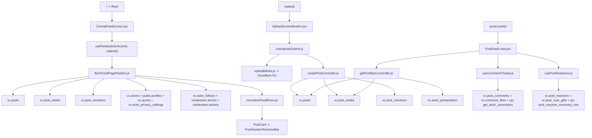
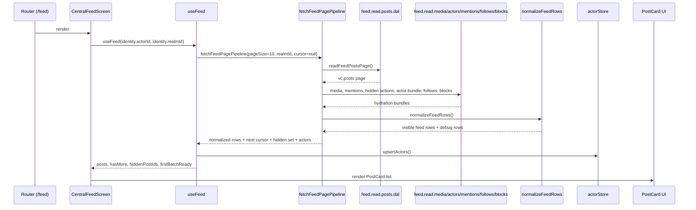
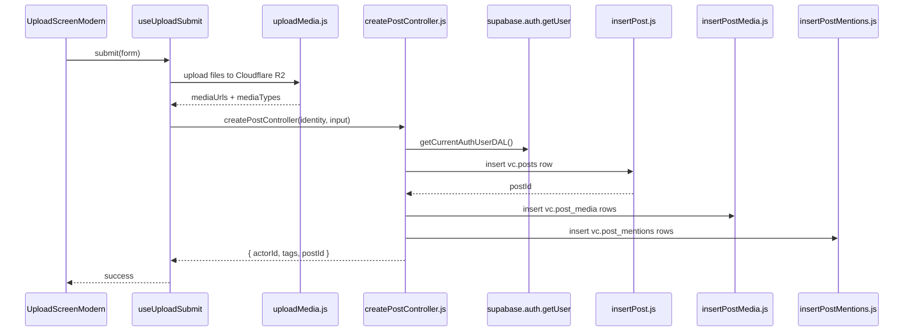

# VCSM Feed and Post System — Complete End-to-End Pipeline

_Audit basis:_ real application code inspection only inside `/Users/vcsm/Desktop/VCSM/apps/VCSM/src`.  
_Not inspected for this document:_ SQL migrations, Supabase policies, triggers, or Edge Functions.  
_Important consequence:_ when runtime behavior appears to depend on DB triggers or RLS, that is called out as **uncertain from app code alone**.

## 1. Architecture Overview

The VCSM feed/post system is **not one single pipeline**. It is a hybrid of:

- a modern central feed path under `features/feed`
- a modern post-creation path under `features/upload`
- a post detail / reactions / comments path under `features/post/postcard` and `features/post/commentcard`
- a separate profile-post listing path under `features/profiles`
- moderation and notification subsystems that cross-cut all of the above

The cleanest runtime slice is the main `/feed` route:

`route -> screen -> hook -> pipeline -> DAL/model -> UI card`

But the overall system is still hybrid because:

- `/feed` and `/posts` both render feed-like experiences
- create-post logic exists in both `features/upload` and `features/post/postcard/dal/post.write.dal.js`
- post detail uses a different read model than central feed
- profile posts use a third read path
- mention hydration exists in at least three separate implementations

### High-level runtime map



### Ownership summary

| Concern | Primary owner | Reality in code |
| --- | --- | --- |
| Central feed loading | `features/feed` | Fairly layered |
| Post creation | `features/upload` | Fairly layered |
| Post detail | `features/post/postcard` | Layered but separate from feed read model |
| Comments/replies | `features/post/commentcard` | Layered, but full-thread only |
| Profile posts | `features/profiles` | Separate duplicated read pipeline |
| Reporting/hide | `features/moderation` | Split between viewer-hide and moderator-hide paths |
| Notifications | `features/notifications` | Mostly read-side only from app code |

## 2. Entry Screens and User Flows

### Main routes

The authoritative route table is in `/Users/vcsm/Desktop/VCSM/apps/VCSM/src/app/routes/protected/app.routes.jsx`.

| Flow | Route | Screen |
| --- | --- | --- |
| Main feed | `/feed` | `/Users/vcsm/Desktop/VCSM/apps/VCSM/src/features/feed/screens/CentralFeedScreen.jsx` |
| Root redirect | `/` | redirects to `/feed` |
| Legacy/parallel feed | `/posts` | `/Users/vcsm/Desktop/VCSM/apps/VCSM/src/features/post/screens/PostFeed.screen.jsx` |
| Post detail | `/posts/:postId` and `/post/:postId` | `/Users/vcsm/Desktop/VCSM/apps/VCSM/src/features/post/screens/PostDetail.screen.jsx` |
| Edit post | `/posts/:postId/edit` and `/post/:postId/edit` | `/Users/vcsm/Desktop/VCSM/apps/VCSM/src/features/post/postcard/ui/EditPost.jsx` |
| Create post | `/upload` | `/Users/vcsm/Desktop/VCSM/apps/VCSM/src/features/upload/screens/UploadScreen.jsx` |
| Notifications deep-link to post | `/noti/post/:postId` | `/Users/vcsm/Desktop/VCSM/apps/VCSM/src/features/notifications/screen/NotiViewPostScreen.jsx` |
| Profile posts | `/profile/:actorId` | `/Users/vcsm/Desktop/VCSM/apps/VCSM/src/features/profiles/screens/ActorProfileScreen.jsx` |

### Main entry screen for the feed

The main feed entry screen is:

- `/Users/vcsm/Desktop/VCSM/apps/VCSM/src/features/feed/screens/CentralFeedScreen.jsx`

`/` redirects to `/feed`, so this is the effective landing screen for feed browsing.

### Create post entry

The post creation flow begins at:

- `/Users/vcsm/Desktop/VCSM/apps/VCSM/src/features/upload/screens/UploadScreen.jsx`
- composed UI in `/Users/vcsm/Desktop/VCSM/apps/VCSM/src/features/upload/screens/UploadScreenModern.jsx`

### Open post detail

Both the central feed and profile posts navigate to:

- `/post/:postId`

which resolves into:

- `/Users/vcsm/Desktop/VCSM/apps/VCSM/src/features/post/screens/PostDetail.view.jsx`

### Comment flow

Comments are not composed inline inside the central feed. The runtime path is:

- feed/profile card comment button
- navigate/open post detail
- post detail loads comment count and full comment thread
- top-level comment or reply is created from the detail screen

### Profile feed flow

Profile posts do **not** reuse the central feed pipeline. They use:

- `/Users/vcsm/Desktop/VCSM/apps/VCSM/src/features/profiles/screens/views/ActorProfilePostsView.jsx`
- `/Users/vcsm/Desktop/VCSM/apps/VCSM/src/features/profiles/screens/views/tabs/post/hooks/useActorPosts.js`
- `/Users/vcsm/Desktop/VCSM/apps/VCSM/src/features/profiles/controller/post/getActorPosts.controller.js`
- `/Users/vcsm/Desktop/VCSM/apps/VCSM/src/features/profiles/dal/post/fetchPostsForActor.dal.js`

That separate path is one of the major architecture duplications in the system.

## 3. Database Schema Authority

### Core feed/post tables

| Table / RPC | Role in runtime |
| --- | --- |
| `vc.posts` | Authoritative post row table for feed, detail, profile posts, create, edit, soft delete |
| `vc.post_media` | Authoritative multi-media attachment table |
| `vc.post_mentions` | Mention edge table from post to mentioned actor |
| `vc.post_comments` | Comments and replies via `parent_id` |
| `vc.comment_likes` | Comment likes |
| `vc.post_reactions` | Like/dislike reactions |
| `vc.post_rose_gifts` | Rose gift rows |
| `vc.notifications` | Read-side notification inbox |
| `moderation.reports` | User-submitted reports against posts/comments/etc. |
| `moderation.report_events` | Report audit/event trail |
| `moderation.actions` | Viewer hide/unhide state and moderator action log |
| `vc.actor_follows` | Accepted follow edges |
| `vc.social_follow_requests` | Pending/accepted follow requests for private actors |
| `moderation.blocks` | Block edges used to remove actors from feed visibility |
| `vc.realms` | Realm identity used for public vs void feed segmentation |
| `vc.actors` | Authoritative actor identity rows |
| `public.profiles` | User actor profile metadata |
| `vc.vports` | VPORT actor metadata |
| `vc.actor_privacy_settings` | Canonical privacy state for user actors |
| `vc.actor_presentation` | Read model / view used in mention and detail hydration |
| `vc.post_reactors_summary_one` (RPC) | Aggregated post like/dislike/rose counts |
| `vc.get_actor_summaries` (RPC) | Actor summary hydration for comments/other actor-store consumers |

### Table-by-table authority notes

#### `vc.posts`

Used as the primary post authority in:

- feed reads: `/Users/vcsm/Desktop/VCSM/apps/VCSM/src/features/feed/dal/feed.read.posts.dal.js`
- detail read: `/Users/vcsm/Desktop/VCSM/apps/VCSM/src/features/post/postcard/dal/post.read.dal.js`
- create: `/Users/vcsm/Desktop/VCSM/apps/VCSM/src/features/upload/dal/insertPost.js`
- edit/delete legacy write DAL: `/Users/vcsm/Desktop/VCSM/apps/VCSM/src/features/post/postcard/dal/post.write.dal.js`
- profile list reads: `/Users/vcsm/Desktop/VCSM/apps/VCSM/src/features/profiles/dal/post/fetchPostsForActor.dal.js`

Important fields observed in real code:

- `id`
- `actor_id`
- `user_id`
- `realm_id`
- `text`
- `title`
- `media_url`
- `media_type`
- `post_type`
- `tags`
- `created_at`
- `edited_at`
- `deleted_at`
- `deleted_by_actor_id`
- `location_text`
- `is_hidden`, `hidden_at`, `hidden_by_actor_id` exist in moderation DALs

#### `vc.post_media`

Used as the multi-media source of truth in:

- feed media hydration
- post detail media carousel
- profile post enrichment
- create-post writes

Observed columns:

- `post_id`
- `url`
- `media_type`
- `sort_order`

#### `vc.post_mentions`

Used in:

- create post mention writes
- edit post mention replacement
- feed mention rendering
- post detail mention rendering
- profile post mention enrichment

Observed columns:

- `post_id`
- `mentioned_actor_id`

#### `vc.post_comments`

Used in:

- detail comment thread load
- comment create
- comment edit
- comment soft delete
- profile photo/comment counts

Observed columns:

- `id`
- `post_id`
- `parent_id`
- `actor_id`
- `content`
- `created_at`
- `deleted_at`

#### `vc.post_reactions` and `vc.post_rose_gifts`

Used by reaction bars only. Counts are not computed in UI directly for posts; they are reloaded from RPC after writes.

#### `vc.notifications`

Only a **read-side notification inbox path** was found in the app for post/comment/reaction notification consumption.  
No client-side writer for post/comment/reaction/mention notifications was found in feed/post/upload code.

#### `moderation.actions`

Used in two distinct meanings:

- viewer-local hide/unhide state for posts/comments
- moderator action log

That dual purpose matters because the central feed’s “hidden for you” behavior is driven by `moderation.actions`, not by `vc.posts.is_hidden`.

## 4. Domain Models

### Feed models

- `/Users/vcsm/Desktop/VCSM/apps/VCSM/src/features/feed/model/normalizeFeedRows.js`
  - Converts raw `vc.posts` rows + actor/media/mention bundles into feed card objects.
- `/Users/vcsm/Desktop/VCSM/apps/VCSM/src/features/feed/model/feedRowVisibility.model.js`
  - Decides if a row is visible for the current viewer.
- `/Users/vcsm/Desktop/VCSM/apps/VCSM/src/features/feed/model/buildMentionMaps.js`
  - Converts mention rows into `{ handleKey -> actor payload }` maps.

The normalized feed object shape includes:

- `id`
- `text`
- `title`
- `created_at`
- `edited_at`
- `deleted_at`
- `post_type`
- `actor_id`
- `location_text`
- `is_hidden_for_viewer`
- `actor`
- `media`
- `mentionMap`

### Post detail model

- `/Users/vcsm/Desktop/VCSM/apps/VCSM/src/features/post/postcard/controller/getPostById.controller.js`

This controller reshapes a single post into:

- `id`
- `actor`
- `text`
- `media`
- `created_at`
- `location_text`
- `locationText`

This is a separate model from the central feed model.

### Profile post canonical model

- `/Users/vcsm/Desktop/VCSM/apps/VCSM/src/features/profiles/model/postCanonical.model.js`

This canonical profile post model normalizes:

- multi-media vs legacy single media
- reaction counts
- location
- mentionMap
- both camelCase and snake_case aliases

### Comment domain model

- `/Users/vcsm/Desktop/VCSM/apps/VCSM/src/features/post/commentcard/model/Comment.model.js`

The comment domain model exists, but the main thread loader more often uses raw rows plus controller-built trees and reaction hydrators instead of constructing `new Comment(...)` everywhere.

### Actor presentation / actor-store shaping

Feed cards and comment cards do not consistently render directly from DB-shaped actor payloads. They often rely on:

- `/Users/vcsm/Desktop/VCSM/apps/VCSM/src/state/actors/actorStore`
- `/Users/vcsm/Desktop/VCSM/apps/VCSM/src/state/actors/useActorSummary.js`
- `/Users/vcsm/Desktop/VCSM/apps/VCSM/src/state/actors/hydrateActors.js`

That means the real display path is:

`DB row -> normalized/hydrated actor summary -> actor store -> PostHeader/Comment UI`

## 5. Layer Stack

### Intended pattern

The codebase clearly wants this layering:

`DAL -> model -> controller/service/pipeline -> hook -> screen -> component`

### Where that pattern is respected

#### Central feed

- screen: `/Users/vcsm/Desktop/VCSM/apps/VCSM/src/features/feed/screens/CentralFeedScreen.jsx`
- hook: `/Users/vcsm/Desktop/VCSM/apps/VCSM/src/features/feed/hooks/useFeed.js`
- pipeline: `/Users/vcsm/Desktop/VCSM/apps/VCSM/src/features/feed/pipeline/fetchFeedPage.pipeline.js`
- DALs: `feed.read.*`
- models: `normalizeFeedRows.js`, `feedRowVisibility.model.js`

This is the cleanest part of the system.

#### Create post

- screen: `/Users/vcsm/Desktop/VCSM/apps/VCSM/src/features/upload/screens/UploadScreenModern.jsx`
- hook: `/Users/vcsm/Desktop/VCSM/apps/VCSM/src/features/upload/hooks/useUploadSubmit.js`
- controller: `/Users/vcsm/Desktop/VCSM/apps/VCSM/src/features/upload/controllers/createPostController.js`
- DALs: `insertPost.js`, `insertPostMedia.js`, `insertPostMentions.js`

Also reasonably layered.

### Where the pattern is only partially respected

#### Post detail

The detail screen is hook-heavy and reasonably separated, but it uses a distinct read pipeline from the feed and a separate mention loader.

#### Comments

Comments are reasonably layered, but there are multiple DALs that overlap:

- `/Users/vcsm/Desktop/VCSM/apps/VCSM/src/features/post/commentcard/dal/postComments.read.dal.js`
- `/Users/vcsm/Desktop/VCSM/apps/VCSM/src/features/post/commentcard/dal/comments.read.dal.js`
- `/Users/vcsm/Desktop/VCSM/apps/VCSM/src/features/post/commentcard/dal/comments.dal.js`

### Where the pattern breaks down

- create-post behavior is duplicated in `/Users/vcsm/Desktop/VCSM/apps/VCSM/src/features/post/postcard/dal/post.write.dal.js`
- profile posts use separate controller + DAL + canonical model
- central feed and legacy `/posts` screen both exist
- notification creation for post actions is not visible in the app layer, so it depends on behavior outside this code path

### Actual judgment on layering

The feed/post system is **partially layered, but not uniformly**. The modern paths are good enough to follow. The full architecture is still hybrid.

## 6. Pipeline 1: Feed Load

### Main entry screen

The main feed load starts at:

- `/Users/vcsm/Desktop/VCSM/apps/VCSM/src/features/feed/screens/CentralFeedScreen.jsx`

`/` redirects to `/feed`, so this is the primary user entry.

### Main hook that loads the feed

The main feed hook is:

- `/Users/vcsm/Desktop/VCSM/apps/VCSM/src/features/feed/hooks/useFeed.js`

Export:

- `useFeed(viewerActorId, realmId)`

### Feed orchestration controller/pipeline

There is no single controller file named “feed controller”; the orchestration boundary is:

- `/Users/vcsm/Desktop/VCSM/apps/VCSM/src/features/feed/pipeline/fetchFeedPage.pipeline.js`

That file is the real end-to-end coordinator.

### DALs that hit the database

The central feed pipeline calls:

- `/Users/vcsm/Desktop/VCSM/apps/VCSM/src/features/feed/dal/feed.read.posts.dal.js` -> `vc.posts`
- `/Users/vcsm/Desktop/VCSM/apps/VCSM/src/features/feed/dal/feed.read.media.dal.js` -> `vc.post_media`
- `/Users/vcsm/Desktop/VCSM/apps/VCSM/src/features/feed/dal/feed.read.hiddenPosts.dal.js` -> `moderation.actions`
- `/Users/vcsm/Desktop/VCSM/apps/VCSM/src/features/feed/dal/feed.read.actorsBundle.dal.js` -> `vc.actors`, `public.profiles`, `vc.actor_privacy_settings`, `vc.vports`
- `/Users/vcsm/Desktop/VCSM/apps/VCSM/src/features/feed/dal/feed.read.blockRows.dal.js` -> `moderation.blocks`
- `/Users/vcsm/Desktop/VCSM/apps/VCSM/src/features/feed/dal/feed.read.followRows.dal.js` -> `vc.actor_follows`
- `/Users/vcsm/Desktop/VCSM/apps/VCSM/src/features/feed/dal/feed.mentions.dal.js` -> `vc.post_mentions`, `vc.actor_presentation`

### Sequence



### Exact runtime behavior

1. `CentralFeedScreen.jsx` resolves:
   - `actorId = identity?.actorId`
   - `realmId = identity?.realmId`
2. It calls `useFeed(actorId, realmId)`.
3. `useFeed` resets its internal state whenever `viewerActorId` or `realmId` changes.
4. `useFeed` performs an initial fetch only once per actor/realm combination.
5. `fetchFeedPagePipeline` reads a `vc.posts` page ordered by `created_at desc`, filtered by:
   - `deleted_at is null`
   - `realm_id == realmId` when a realm is present
   - `created_at < cursorCreatedAt` when paginating
6. The pipeline hydrates:
   - media from `vc.post_media`
   - mention edges from `vc.post_mentions`
   - actor rows from `vc.actors`
   - user profile rows from `public.profiles`
   - privacy from `vc.actor_privacy_settings`
   - vport rows from `vc.vports`
   - follow edges from `vc.actor_follows`
   - block edges from `moderation.blocks`
   - viewer-local hidden rows from `moderation.actions`
7. `normalizeFeedRows` applies the visibility model and returns only visible rows.
8. `useFeed` also upserts actor summaries into the global actor store so `PostHeader` can render actor names/avatars from IDs.

### How posts are mapped from raw rows to UI objects

`normalizeFeedRows.js` is the main feed row mapper.

It:

- resolves visibility first
- merges `vc.post_media` rows into a `media[]` array
- falls back to `vc.posts.media_url/media_type` for legacy posts
- attaches actor presentation fields using `actorMap + profileMap + vportMap`
- attaches `mentionMap`
- marks `is_hidden_for_viewer`

### Authoritative feed item tables

For central feed cards, the authoritative data comes from:

- `vc.posts`
- `vc.post_media`
- `vc.actors`
- `public.profiles`
- `vc.vports`
- `vc.actor_privacy_settings`
- `vc.actor_follows`
- `moderation.blocks`
- `moderation.actions`
- `vc.post_mentions`

### Important feed-side caveats

- `viewerIsAdult` is loaded via `/Users/vcsm/Desktop/VCSM/apps/VCSM/src/features/feed/controllers/getFeedViewerContext.controller.js`, but from app code it is **not used** in filtering or rendering.
- VPORT visibility is based on `vports.is_active`, not on follow/private rules.
- User privacy is enforced in client code using `actor_privacy_settings` + `actor_follows`.

## 7. Pipeline 2: Feed Pagination / Refresh

### Central feed pagination

Central feed pagination is implemented in:

- `/Users/vcsm/Desktop/VCSM/apps/VCSM/src/features/feed/screens/CentralFeedScreen.jsx`
- `/Users/vcsm/Desktop/VCSM/apps/VCSM/src/features/feed/hooks/useFeed.js`

Behavior:

- `IntersectionObserver` watches a sentinel element
- when the sentinel enters the viewport and `hasMore && !loading`, it calls `fetchPosts(false)`
- cursor is based on `created_at`

### Pagination semantics

Observed constants from `useFeed.js`:

- `PAGE_SIZE = 10`
- `MAX_EMPTY_PAGES_PER_FETCH = 3`
- `INITIAL_VISIBLE_TARGET = 3`

This means the feed can pull multiple backend pages in one fetch cycle if early pages are fully filtered out by privacy/blocking rules.

### Refresh behavior

The main refresh path is:

- `PullToRefresh` in `CentralFeedScreen.jsx`
- `handleRefresh()`:
  - scrolls container to top
  - calls `fetchViewer()`
  - calls `fetchPosts(true)`

When `fresh = true`, `useFeed`:

- resets cursor
- clears hidden post ids
- clears first-batch readiness
- preloads media for the first visible posts

### First paint behavior

`useFeed` intentionally tries to surface a small number of visible items quickly:

- it stops once it has `INITIAL_VISIBLE_TARGET` visible posts on fresh load
- it preloads the first image media batch before setting `firstBatchReady`

### Deduplication behavior

Paginated rows are merged by post id:

- fresh load replaces the list
- subsequent loads use a `Map(prev.map((p) => [p.id, p]))` merge

### Legacy/parallel pagination path

`/posts` uses:

- `/Users/vcsm/Desktop/VCSM/apps/VCSM/src/features/post/screens/PostFeed.screen.jsx`

This path still relies on `useFeed`, but pagination is done by:

- window scroll listener
- “near bottom” threshold based on document height

So there are two live infinite-scroll implementations in the app.

### Risks in pagination/refresh

- cursoring only by `created_at` can skip/duplicate rows if many posts share the same timestamp
- filter-heavy fetches can prematurely stop after `MAX_EMPTY_PAGES_PER_FETCH = 3`
- central feed and legacy `/posts` use different scroll mechanics

## 8. Pipeline 3: Create Post

### Entry path

Create-post starts at:

- `/Users/vcsm/Desktop/VCSM/apps/VCSM/src/features/upload/screens/UploadScreen.jsx`
- `/Users/vcsm/Desktop/VCSM/apps/VCSM/src/features/upload/screens/UploadScreenModern.jsx`

### Actual create-post runtime



### Screen/hook/controller/DAL stack

- screen: `/Users/vcsm/Desktop/VCSM/apps/VCSM/src/features/upload/screens/UploadScreenModern.jsx`
- hook: `/Users/vcsm/Desktop/VCSM/apps/VCSM/src/features/upload/hooks/useUploadSubmit.js`
- controller: `/Users/vcsm/Desktop/VCSM/apps/VCSM/src/features/upload/controllers/createPostController.js`
- DALs:
  - `/Users/vcsm/Desktop/VCSM/apps/VCSM/src/features/upload/dal/insertPost.js`
  - `/Users/vcsm/Desktop/VCSM/apps/VCSM/src/features/upload/dal/insertPostMedia.js`
  - `/Users/vcsm/Desktop/VCSM/apps/VCSM/src/features/upload/dal/insertPostMentions.js`
  - rollback helper `/Users/vcsm/Desktop/VCSM/apps/VCSM/src/features/upload/dal/postAuthRollback.dal.js`

### Media handling

Media uploads do **not** use Supabase Storage in this path.

The upload path is:

- `/Users/vcsm/Desktop/VCSM/apps/VCSM/src/features/upload/api/uploadMedia.js`
- uploads to Cloudflare via `/Users/vcsm/Desktop/VCSM/apps/VCSM/src/services/cloudflare/uploadToCloudflare`

Runtime behavior:

- `mode === "post"` allows up to 10 images
- non-post modes collapse to one file
- uploaded URLs are returned to the controller
- the controller writes those URLs into `vc.post_media`
- the first media item is also duplicated into `vc.posts.media_url/media_type` for backward compatibility

### Post row insert

`createPostController.js` builds the authoritative post row:

- `user_id`: current auth user id
- `actor_id`: `identity.actorId`
- `realm_id`: `resolveRealm(identity.isVoid)`
- `text`: trimmed caption
- `media_url`/`media_type`: first media fallback
- `post_type`: `input.mode`
- `tags`: extracted hashtags
- `created_at`: client timestamp
- `location_text`: trimmed text location

### Mentions handling

Create-post uses a two-tier mention strategy:

1. preferred path:
   - UI sends `mentionsResolved`
   - controller extracts `actorId`s directly
2. fallback path:
   - parse caption `@handles`
   - resolve handles through `/Users/vcsm/Desktop/VCSM/apps/VCSM/src/features/upload/dal/findActorsByHandles.js`
   - insert `vc.post_mentions`

This means create-post supports **selected mentions even if the final caption text does not contain a literal `@handle` token**.

### Rollback behavior

If `vc.post_media` insert fails after the post row is created:

- `createPostController.js` calls `deletePostByIdDAL(postId)`
- that rollback performs a hard delete on `vc.posts`

Mention insert failure is different:

- mention insert failure is logged
- the post is still considered successfully created

### Navigation after create

`UploadScreen.jsx` does:

- `await submit(form)`
- `navigate("/")`

Because `/` redirects to `/feed`, the usual refresh behavior is a route-level remount and feed reload, not an explicit feed cache mutation.

### Important create-post caveats

- `visibility` is captured in `UploadScreenModern.jsx` and passed down, but `createPostController.js` does not use it. There is no per-post visibility field enforced in this flow.
- `realm_id` is derived from `identity.isVoid` using hard-coded IDs in `resolveRealm.js`, not from `identity.realmId` directly.

## 9. Pipeline 4: Edit Post

### Entry route

Edit post lives at:

- `/posts/:postId/edit`
- `/post/:postId/edit`

Screen:

- `/Users/vcsm/Desktop/VCSM/apps/VCSM/src/features/post/postcard/ui/EditPost.jsx`

### Edit stack

- UI screen: `EditPost.jsx`
- controller: `/Users/vcsm/Desktop/VCSM/apps/VCSM/src/features/post/postcard/controller/editPost.controller.js`
- DAL: `/Users/vcsm/Desktop/VCSM/apps/VCSM/src/features/post/postcard/dal/post.write.dal.js`

### Exact behavior

`EditPost.jsx`:

- reads `postId` from route params
- reads `initialText` from router `location.state`
- uses `identity.actorId` as the owner actor
- calls `editPostController({ actorId, postId, text })`

`editPostController`:

- trims input
- rejects empty text
- calls `updatePostTextDAL`

`updatePostTextDAL`:

- updates `vc.posts.text`
- sets `edited_at`
- owner-gates by `.eq("actor_id", actorId)`
- best-effort replaces mention edges in `vc.post_mentions`

### What edit does not do

The edit path only updates:

- `text`
- `edited_at`
- mention edges derived from text

It does **not** update:

- `post_media`
- `location_text`
- `title`
- `tags`
- `realm_id`

### Edit refresh semantics

On success the screen does:

- `navigate(-1)`

There is no global post cache invalidation event. The app relies on:

- back navigation to a still-mounted parent screen
- or a route remount later

### Important edit caveats

1. `EditPost.jsx` depends on `location.state.initialText` for the initial body text.
2. If the edit route is opened directly or reloaded, no controller fetch populates the existing text.
3. `/Users/vcsm/Desktop/VCSM/apps/VCSM/src/features/profiles/hooks/useActorProfileActions.js` navigates to `/post/:postId/edit` **without** passing `initialText`, so profile-based edit entry is especially likely to land on an empty editor.
4. Edit mention handling is weaker than create mention handling:
   - create supports resolved mention actor ids from UI selection
   - edit only reparses explicit `@handle` tokens from text

## 10. Pipeline 5: Delete / Hide Post

There are three distinct post-removal semantics in code:

1. owner soft delete
2. viewer-local hide/cover
3. moderator/global hide

### 10.1 Owner soft delete

Path:

- hook: `/Users/vcsm/Desktop/VCSM/apps/VCSM/src/features/post/postcard/hooks/useDeletePostAction.js`
- controller: `/Users/vcsm/Desktop/VCSM/apps/VCSM/src/features/post/postcard/controller/deletePost.controller.js`
- DAL: `/Users/vcsm/Desktop/VCSM/apps/VCSM/src/features/post/postcard/dal/post.write.dal.js`

`softDeletePostDAL({ actorId, postId })`:

- sets `deleted_at`
- sets `deleted_by_actor_id`
- owner-gates by post `actor_id`

Read-side effect:

- central feed excludes `.is("deleted_at", null)` only
- profile post list excludes `.is("deleted_at", null)`
- comment count/detail paths also rely on the post still existing when opened

### 10.2 Viewer-local hide after report

User reporting from feed/detail does not immediately soft-delete the post. Instead it:

1. creates a report row in `moderation.reports`
2. optionally writes a report event
3. persists a viewer-local `hide` action in `moderation.actions`

Feed/report paths:

- central feed actions: `/Users/vcsm/Desktop/VCSM/apps/VCSM/src/features/feed/hooks/useCentralFeedActions.js`
- detail reporting: `/Users/vcsm/Desktop/VCSM/apps/VCSM/src/features/post/postcard/hooks/usePostDetailReporting.js`
- report controller: `/Users/vcsm/Desktop/VCSM/apps/VCSM/src/features/moderation/controllers/report.controller.js`
- visibility controller: `/Users/vcsm/Desktop/VCSM/apps/VCSM/src/features/moderation/controllers/postVisibility.controller.js`

This is why the UI often shows a cover/overlay rather than removing the post globally.

### 10.3 Moderator/global hide

There is a moderator path in:

- `/Users/vcsm/Desktop/VCSM/apps/VCSM/src/features/moderation/controllers/moderationActions.controller.js`

It is intended to:

- read `moderation.reports`
- set `vc.posts.is_hidden = true`
- insert a moderation action row
- update report status

However, from app code:

- feed/detail read paths do **not** explicitly filter `vc.posts.is_hidden`
- there is no central feed filter on `hidden_at` or `hidden_by_actor_id`

So the real enforcement of global moderation hide is **uncertain from app code alone**. It may depend on RLS or DB-side views/policies.

### 10.4 Different delete UI behaviors by screen

| Screen | On successful delete |
| --- | --- |
| Central feed (`CentralFeedScreen.jsx`) | refetches feed with `fetchPosts(true)` |
| Legacy `/posts` (`PostFeed.screen.jsx`) | locally filters deleted post from state |
| Post detail (`PostDetail.view.jsx`) | `navigate(-1)` |
| Profile posts | `useActorProfileActions` calls `onPostDeleted?.()` to trigger parent refresh |

That means delete behavior is not fully unified across screens.

## 11. Pipeline 6: Reactions / Roses / Gifts

### UI entry

Reaction UI is rendered by:

- `/Users/vcsm/Desktop/VCSM/apps/VCSM/src/features/post/postcard/components/ReactionBar.jsx`

which is embedded both in:

- post cards
- post detail

### Hook / controller / DAL stack

- hook: `/Users/vcsm/Desktop/VCSM/apps/VCSM/src/features/post/postcard/hooks/usePostReactions.js`
- read controller: `/Users/vcsm/Desktop/VCSM/apps/VCSM/src/features/post/postcard/controller/getPostReactions.controller.js`
- toggle controller: `/Users/vcsm/Desktop/VCSM/apps/VCSM/src/features/post/postcard/controller/togglePostReaction.controller.js`
- rose controller: `/Users/vcsm/Desktop/VCSM/apps/VCSM/src/features/post/postcard/controller/sendRose.controller.js`
- read DAL: `/Users/vcsm/Desktop/VCSM/apps/VCSM/src/features/post/postcard/dal/postReactions.read.dal.js`
- write DAL: `/Users/vcsm/Desktop/VCSM/apps/VCSM/src/features/post/postcard/dal/postReactions.write.dal.js`
- rose DAL: `/Users/vcsm/Desktop/VCSM/apps/VCSM/src/features/post/postcard/dal/roseGifts.actor.dal.js`

### Read path

For a given post:

1. `usePostReactions(postId)` loads once identity is ready
2. `getPostReactionsController` reads:
   - actor’s own row from `vc.post_reactions`
   - aggregate rows from RPC `vc.post_reactors_summary_one`
3. hook stores:
   - `myReaction`
   - `counts.like`
   - `counts.dislike`
   - `counts.rose`

### Write path for like/dislike

`togglePostReactionController`:

1. reads current actor reaction row
2. if same reaction exists -> delete row
3. if a different reaction exists -> update row
4. if none exists -> insert row
5. reloads aggregate counts through the RPC

### Write path for roses

`sendRoseController`:

1. inserts one row into `vc.post_rose_gifts`
2. reloads aggregate counts through the same RPC

### Aggregation authority

The post reaction count UI does **not** compute totals in the client from local cached rows.  
It re-reads from:

- `vc.post_reactors_summary_one`

That RPC is the authoritative aggregate source for post like/dislike/rose counters.

### Optimistic UI behavior

No true optimistic reaction UI was found.

`usePostReactions.js`:

- sets `loading`
- waits for controller success
- then updates local state from server-returned results

### Notification effects

The notification UI supports:

- `like`
- `dislike`
- `post_rose`

But no client-side notification write for these actions was found in the reaction controllers or DALs.  
This likely depends on DB triggers or another write path outside the inspected app code.

## 12. Pipeline 7: Comments / Replies

### Comment read path

Comments are primarily loaded in post detail via:

- hook: `/Users/vcsm/Desktop/VCSM/apps/VCSM/src/features/post/commentcard/hooks/useCommentThread.js`
- controller: `/Users/vcsm/Desktop/VCSM/apps/VCSM/src/features/post/commentcard/controller/postComments.controller.js`
- DAL: `/Users/vcsm/Desktop/VCSM/apps/VCSM/src/features/post/commentcard/dal/postComments.read.dal.js`

`listPostComments(postId)`:

- reads `vc.post_comments`
- filters `deleted_at is null`
- orders `created_at asc`
- loads the entire thread at once

### Thread shaping

`buildTree(rows)` in `postComments.controller.js`:

- groups rows by `id`
- uses `parent_id` to nest replies
- root comments are rows with `parent_id = null`

### Actor hydration for comments

The comment thread loader does not inline all actor presentation in the base comment query.

Instead it:

1. loads comment rows
2. flattens the tree
3. calls `/Users/vcsm/Desktop/VCSM/apps/VCSM/src/state/actors/hydrateActors.js`
4. that calls RPC `vc.get_actor_summaries`
5. actor summaries are inserted into actor store

### Comment like hydration

After actor hydration, `useCommentThread.js` calls:

- `/Users/vcsm/Desktop/VCSM/apps/VCSM/src/features/post/commentcard/controller/commentReactions.hydrator.controller.js`

That hydrator reads:

- all like rows for the thread’s comment ids from `vc.comment_likes`
- viewer-specific like rows from `vc.comment_likes`

and annotates each comment with:

- `is_liked`
- `like_count`

### Create comment / create reply

Comment create path:

- `createRootComment({ postId, actorId, content })`

Reply create path:

- `createReplyComment({ postId, actorId, parentCommentId, content })`

DAL:

- `/Users/vcsm/Desktop/VCSM/apps/VCSM/src/features/post/commentcard/dal/comments.dal.js`

Both write into `vc.post_comments`, with replies distinguished by `parent_id`.

### Edit / delete comment

- edit controller: `/Users/vcsm/Desktop/VCSM/apps/VCSM/src/features/post/commentcard/controller/editComment.controller.js`
- delete controller: `/Users/vcsm/Desktop/VCSM/apps/VCSM/src/features/post/commentcard/controller/deleteComment.controller.js`

Delete is a soft delete:

- sets `deleted_at`
- owner-gated by `actor_id`

### UI update semantics

Comment creation is not truly optimistic-before-server. The flow is:

1. write succeeds on server
2. actor/reaction metadata is hydrated for the new comment
3. hook appends it locally

So it is “locally appended after success”, not optimistic in the usual sense.

### Comment count path

Post cards and detail use:

- hook: `/Users/vcsm/Desktop/VCSM/apps/VCSM/src/features/post/commentcard/hooks/usePostCommentCount.js`
- controller: `/Users/vcsm/Desktop/VCSM/apps/VCSM/src/features/post/commentcard/controller/postComments.count.controller.js`
- DAL: `/Users/vcsm/Desktop/VCSM/apps/VCSM/src/features/post/commentcard/dal/postComments.count.dal.js`

This counts all non-deleted comments for a post, including replies.

### Comment moderation/hide

Comment reporting and cover behavior use:

- `/Users/vcsm/Desktop/VCSM/apps/VCSM/src/features/post/postcard/hooks/useCommentCovers.js`
- `/Users/vcsm/Desktop/VCSM/apps/VCSM/src/features/moderation/controllers/commentVisibility.controller.js`

Important policy:

- hiding a root comment can propagate hidden coverage to its replies
- hiding a reply does not propagate upward

### Important comment caveats

- there is no comment pagination in the main detail thread loader
- full threads are loaded every time
- there are overlapping read DALs (`comments.read.dal.js` and `postComments.read.dal.js`)
- a legacy `deleteComment(commentId)` without owner gate still exists in `comments.dal.js`

## 13. Pipeline 8: Mentions / Tags / Notifications

### Mention extraction on create

Create-post mention extraction lives in:

- `/Users/vcsm/Desktop/VCSM/apps/VCSM/src/features/upload/lib/extractMentions.js`
- `/Users/vcsm/Desktop/VCSM/apps/VCSM/src/features/upload/dal/findActorsByHandles.js`
- `/Users/vcsm/Desktop/VCSM/apps/VCSM/src/features/upload/dal/insertPostMentions.js`

The system supports:

- literal `@handle` parsing
- resolved mention actor ids from UI selection

### Mention search/autocomplete

Autocomplete path:

- hook: `/Users/vcsm/Desktop/VCSM/apps/VCSM/src/features/upload/hooks/useMentionAutocomplete.js`
- controller: `/Users/vcsm/Desktop/VCSM/apps/VCSM/src/features/upload/controller/searchMentionSuggestions.controller.js`
- DAL: `/Users/vcsm/Desktop/VCSM/apps/VCSM/src/features/upload/dal/searchMentionSuggestions.js`

The search source is:

- `vc.actor_presentation`

### Mention read/rendering paths

There are multiple parallel mention readers:

#### Feed

- `/Users/vcsm/Desktop/VCSM/apps/VCSM/src/features/feed/dal/feed.mentions.dal.js`
- `/Users/vcsm/Desktop/VCSM/apps/VCSM/src/features/feed/model/buildMentionMaps.js`

#### Post detail

- `/Users/vcsm/Desktop/VCSM/apps/VCSM/src/features/post/postcard/controller/getPostMentionMap.controller.js`
- `/Users/vcsm/Desktop/VCSM/apps/VCSM/src/features/post/postcard/dal/postMentions.read.dal.js`

#### Profile posts

- `/Users/vcsm/Desktop/VCSM/apps/VCSM/src/features/profiles/dal/post/fetchPostsForActor.dal.js`

This is a significant duplication point.

### Hashtags / tags

Hashtags are extracted at create time by:

- `/Users/vcsm/Desktop/VCSM/apps/VCSM/src/features/upload/lib/extractHashtags.js`

They are stored in:

- `vc.posts.tags`

From inspected app code, tags are not a main feed filter input; they are stored and carried along with the post row.

### Notifications caused by post actions

#### What the notification UI supports

`/Users/vcsm/Desktop/VCSM/apps/VCSM/src/features/notifications/inbox/ui/NotificationItem.view.jsx` supports:

- `follow_request`
- `follow_request_accepted`
- `follow`
- `comment`
- `comment_like`
- `comment_reply`
- `like`
- `dislike`
- `post_rose`
- `post_mention`

#### What app code actually writes

From feed/post/upload code inspection:

- no client-side writer was found for post-like notifications
- no client-side writer was found for comment notifications
- no client-side writer was found for post-mention notifications

The only explicit notification creation DAL found was:

- `/Users/vcsm/Desktop/VCSM/apps/VCSM/src/features/notifications/inbox/dal/notifications.create.dal.js`

But it was not called by feed/post/upload code for post/comment/reaction actions.

#### Best-supported conclusion

For post/comment/reaction/mention notifications, the app appears to be primarily a **reader** of `vc.notifications`, not the writer.  
Notification creation for those actions is therefore **uncertain from app code alone** and likely handled by DB triggers or another layer.

#### Follow-specific exception

Follow code explicitly documents DB-trigger ownership:

- `/Users/vcsm/Desktop/VCSM/apps/VCSM/src/features/social/friend/subscribe/controllers/follow.controller.js`
- `/Users/vcsm/Desktop/VCSM/apps/VCSM/src/features/social/friend/request/controllers/followRequests.controller.js`

Comments in those files say notifications are generated by DB triggers on:

- `vc.actor_follows`
- `vc.social_follow_requests`

## 14. Pipeline 9: Actor Identity Interaction

### Identity source used by feed/post

Feed and post flows consume:

- `/Users/vcsm/Desktop/VCSM/apps/VCSM/src/state/identity/identityContext.jsx`

`useIdentity()` returns:

- `identity`
- `loading`
- `identityLoading`
- `setIdentity`
- `switchActor`

### How actor identity affects feed loading

Central feed reads:

- `identity.actorId`
- `identity.realmId`

and passes them to `useFeed(actorId, realmId)`.

`useFeed` fully resets when either changes:

- clears posts
- clears cursor
- clears hidden post ids
- clears debug rows
- resets first batch state

So actor switching causes a full feed reload.

### Citizen posting vs VPORT posting

Post creation always uses:

- `actor_id = identity.actorId`

So the author changes entirely with the selected actor.

Observed identity mapping:

- user actors are mapped through `mapProfileActor(...)`
- VPORT actors are mapped through `mapVportActor(...)`

in:

- `/Users/vcsm/Desktop/VCSM/apps/VCSM/src/state/identity/identity.controller.js`

### What changes when actor switches

`switchActor(actorId)` in `identityContext.jsx`:

1. resolves current platform context through the identity engine
2. writes platform preference with `engineSwitchActiveActor(...)`
3. hydrates the selected actor into VCSM identity
4. updates React state

Once state changes:

- feed reloads with new `viewerActorId` and possibly new `realmId`
- post authorship changes for new posts
- follow/block/report actions run under the new actor id
- comment/reaction ownership semantics also change to the new actor id

### Realm interaction from identity

Identity objects include:

- `realmId`
- `isVoid`

But create-post uses:

- `resolveRealm(identity.isVoid)`

not `identity.realmId` directly.

That is fine for a two-realm system, but it is a coupling risk if realm configuration grows beyond public/void.

### Viewer adulthood

`getFeedViewerIsAdult({ viewerActorId })`:

- returns `true` automatically for VPORT actors
- otherwise reads `public.profiles.is_adult`

But from app code, that flag is currently unused in feed filtering.

## 15. Feed Filtering / Visibility / Realms

### Realm filtering

Feed query:

- `/Users/vcsm/Desktop/VCSM/apps/VCSM/src/features/feed/dal/feed.read.posts.dal.js`

applies:

- `.eq("realm_id", realmId)` when a realm is present

So realm is a first-class feed partition key.

### Public vs void

Create-post uses:

- `/Users/vcsm/Desktop/VCSM/apps/VCSM/src/shared/utils/resolveRealm.js`

with two hard-coded IDs:

- public realm
- void realm

### Visibility rules for user actors

`resolveFeedRowVisibilityModel(...)` applies:

- blocked actors are hidden
- missing actor/profile rows are hidden
- private user actors are visible only if:
  - viewer is owner, or
  - viewer actively follows them

Private visibility helper:

- `/Users/vcsm/Desktop/VCSM/apps/VCSM/src/features/feed/model/feedPrivateVisibility.model.js`

### Visibility rules for VPORT actors

VPORT feed rows are visible if:

- `vport.is_active !== false`

They do **not** go through the private/follow gate.

### Follow impact on feed

Feed follow visibility is driven by:

- `vc.actor_follows`

read through:

- `/Users/vcsm/Desktop/VCSM/apps/VCSM/src/features/feed/dal/feed.read.followRows.dal.js`

Private actors require an active follow edge to become feed-visible.

Pending follow requests do not count, because the feed only checks:

- `is_active = true`

on `vc.actor_follows`.

### Follow request impact

Private follow flow uses:

- `vc.social_follow_requests`

but until acceptance produces an active `vc.actor_follows` row, the private actor’s posts remain hidden in feed.

### Block impact on feed

Block filtering is driven by:

- `moderation.blocks`

through:

- `/Users/vcsm/Desktop/VCSM/apps/VCSM/src/features/feed/dal/feed.read.blockRows.dal.js`

The blocked set includes:

- actors I blocked
- actors who blocked me

### Viewer-local hide impact

Per-viewer post hiding is driven by:

- `moderation.actions`

through:

- `/Users/vcsm/Desktop/VCSM/apps/VCSM/src/features/feed/dal/feed.read.hiddenPosts.dal.js`

Latest action wins between:

- `hide`
- `unhide`

### Important filtering caveats

- Feed filtering is partly client-side after reading the page from `vc.posts`.
- If hidden/global moderation depends on RLS instead of client filters, that logic is outside the app code.
- The upload composer’s `visibility` field currently does not participate in feed filtering.

## 16. Moderation / Reports / Hidden State

### Report creation

Report flow is owned by:

- hook: `/Users/vcsm/Desktop/VCSM/apps/VCSM/src/features/moderation/hooks/useReportFlow.js`
- controller: `/Users/vcsm/Desktop/VCSM/apps/VCSM/src/features/moderation/controllers/report.controller.js`
- DAL: `/Users/vcsm/Desktop/VCSM/apps/VCSM/src/features/moderation/dal/reports.dal.js`

On submit:

1. create report row in `moderation.reports`
2. best-effort create event in `moderation.report_events`
3. if UI chooses, persist viewer-local hide in `moderation.actions`

### Feed/post visibility after user reports

User reports do not globally delete content. They typically lead to:

- a report row
- a viewer-local cover/hide state

Central feed:

- refreshes the feed after report submission and overlays the hidden row

Post detail:

- shows a “reported” cover for the post
- covers comments if the user reported a comment

### Comment hide propagation

Comment hide policy in `commentVisibility.controller.js`:

- hidden root comment can cover descendants
- hidden reply does not cover its parent

### Moderator enforcement path

Moderator controllers intend to:

- hide the underlying post/message row
- log moderation action
- mark the report actioned

But the app-side read paths do not explicitly consume `posts.is_hidden`.

### Architecture warning on moderator path

`/Users/vcsm/Desktop/VCSM/apps/VCSM/src/features/moderation/controllers/moderationActions.controller.js`

imports multiple functions from `moderationActions.dal.js` that, from inspected code, are actually defined in `reports.dal.js`.  
That suggests the moderator hide path is stale or internally inconsistent on the client side.

### Hidden/deleted enforcement summary

| State | Where written | Where enforced |
| --- | --- | --- |
| Owner soft delete | `vc.posts.deleted_at` | explicit client filters in feed/profile reads |
| Viewer hide | `moderation.actions` | explicit client cover logic in feed/post/comment flows |
| Moderator hide | `vc.posts.is_hidden` + moderation action | uncertain from app code alone |

## 17. Realtime / Refresh Semantics

### Feed and posts

No realtime subscription was found for:

- feed post list
- post detail
- reactions
- comments

The feed/post system is therefore primarily:

- mount-driven
- navigation-driven
- manual-refresh-driven

### Feed refresh semantics

- initial mount triggers feed load
- pull-to-refresh triggers `fetchViewer()` then `fetchPosts(true)`
- infinite scroll triggers `fetchPosts(false)`

### Comment/reaction refresh semantics

- reactions refetch aggregate state after writes
- comments append locally after server success
- full thread reload is available but not continuously active

### Notification subsystem exception

The notification badge does have realtime behavior:

- `/Users/vcsm/Desktop/VCSM/apps/VCSM/src/features/notifications/inbox/realtime/badgeSubscriptions.js`

Subscribes to:

- `vc.notifications`

for `INSERT`, `UPDATE`, and `DELETE`, filtered by `recipient_actor_id`.

`useNotiCount.js` also polls every 60 seconds as a fallback.

This is notification realtime, not feed/post realtime.

### Final consistency model

The feed/post UX is best described as:

- manual refresh for lists
- request/response for writes
- local append-after-success for comments
- no cross-client live updates

## 18. Key Files Reference

| File | Role |
| --- | --- |
| `/Users/vcsm/Desktop/VCSM/apps/VCSM/src/app/routes/protected/app.routes.jsx` | Route ownership for feed, post detail, edit, upload, notifications, profile |
| `/Users/vcsm/Desktop/VCSM/apps/VCSM/src/features/feed/screens/CentralFeedScreen.jsx` | Main feed entry screen |
| `/Users/vcsm/Desktop/VCSM/apps/VCSM/src/features/feed/hooks/useFeed.js` | Feed loading, pagination, refresh, first-batch handling |
| `/Users/vcsm/Desktop/VCSM/apps/VCSM/src/features/feed/pipeline/fetchFeedPage.pipeline.js` | Main feed orchestration boundary |
| `/Users/vcsm/Desktop/VCSM/apps/VCSM/src/features/feed/dal/feed.read.posts.dal.js` | Feed page read from `vc.posts` |
| `/Users/vcsm/Desktop/VCSM/apps/VCSM/src/features/feed/model/normalizeFeedRows.js` | Feed row normalization into UI model |
| `/Users/vcsm/Desktop/VCSM/apps/VCSM/src/features/feed/model/feedRowVisibility.model.js` | Privacy/follow/block/inactive-vport visibility rules |
| `/Users/vcsm/Desktop/VCSM/apps/VCSM/src/features/upload/screens/UploadScreenModern.jsx` | Create-post composer UI |
| `/Users/vcsm/Desktop/VCSM/apps/VCSM/src/features/upload/hooks/useUploadSubmit.js` | Create-post UI orchestration |
| `/Users/vcsm/Desktop/VCSM/apps/VCSM/src/features/upload/controllers/createPostController.js` | Main authoritative create-post controller |
| `/Users/vcsm/Desktop/VCSM/apps/VCSM/src/features/upload/api/uploadMedia.js` | Cloudflare media upload path |
| `/Users/vcsm/Desktop/VCSM/apps/VCSM/src/features/post/screens/PostDetail.view.jsx` | Post detail, comments, report, delete orchestration |
| `/Users/vcsm/Desktop/VCSM/apps/VCSM/src/features/post/postcard/controller/getPostById.controller.js` | Post detail read shaping |
| `/Users/vcsm/Desktop/VCSM/apps/VCSM/src/features/post/postcard/dal/post.read.dal.js` | Single-post detail read |
| `/Users/vcsm/Desktop/VCSM/apps/VCSM/src/features/post/postcard/dal/post.write.dal.js` | Legacy/parallel create/edit/delete post DAL |
| `/Users/vcsm/Desktop/VCSM/apps/VCSM/src/features/post/postcard/hooks/usePostReactions.js` | Post reaction lifecycle hook |
| `/Users/vcsm/Desktop/VCSM/apps/VCSM/src/features/post/commentcard/hooks/useCommentThread.js` | Comment thread load/create/reply orchestration |
| `/Users/vcsm/Desktop/VCSM/apps/VCSM/src/features/post/commentcard/dal/comments.dal.js` | Comment create/edit/soft delete writes |
| `/Users/vcsm/Desktop/VCSM/apps/VCSM/src/features/post/commentcard/dal/postComments.read.dal.js` | Full thread read |
| `/Users/vcsm/Desktop/VCSM/apps/VCSM/src/features/moderation/controllers/report.controller.js` | Report creation boundary |
| `/Users/vcsm/Desktop/VCSM/apps/VCSM/src/features/moderation/controllers/postVisibility.controller.js` | Viewer-local post hide/unhide |
| `/Users/vcsm/Desktop/VCSM/apps/VCSM/src/features/notifications/inbox/controller/Notifications.controller.js` | Notification inbox read pipeline |
| `/Users/vcsm/Desktop/VCSM/apps/VCSM/src/features/profiles/dal/post/fetchPostsForActor.dal.js` | Separate profile-post listing pipeline |
| `/Users/vcsm/Desktop/VCSM/apps/VCSM/src/state/identity/identityContext.jsx` | Current actor identity and actor switch behavior |
| `/Users/vcsm/Desktop/VCSM/apps/VCSM/src/state/identity/identity.controller.js` | Identity load + actor hydration entry for feed/post consumers |

## 19. VPORT System Post Types

VPORT owners can publish structured system posts to the central feed from their dashboards. These use `post_type` values in `vc.posts` and are created via `createSystemPost` in `features/upload/adapters/posts.adapter.js`.

### Architecture contract for system posts

All VPORT system posts must:

- Use `resolvePublicRealmIdDAL()` from `features/feed/dal/resolvePublicRealm.dal.js` — never read `realmId` from viewer session or `useIdentity()`
- Never post to the Void realm — `barbershop_*` and all current system posts are public-only by construction
- Be non-blocking — the primary owner action (rate save, hours save, portfolio create) must succeed regardless of feed publish outcome
- Dedup within a 1-hour window per `actorId + post_type` to prevent spam
- Pass through the feed renderer as normal text/media posts if no custom renderer is registered

### Known system post types

| `post_type` | VPORT type | Trigger | Media | Dedup key |
|---|---|---|---|---|
| `exchange_rate_update` | `exchange` | Owner publishes FX rate | None | `actorId + post_type` 1h |
| `fuel_price_update` | `gas station` | Owner publishes fuel prices | None | `actorId + post_type` 1h |
| `menu_update` | `restaurant` (and others) | Owner updates menu item | Optional image URL | `actorId + post_type` 1h |
| `barbershop_hours_update` | `barbershop`, `barber` | Owner saves working hours | None | `actorId + post_type` 1h |
| `barbershop_portfolio_update` | `barbershop`, `barber` | Owner creates new portfolio item | First uploaded photo URL (optional) | `actorId + post_type` 1h |
| `locksmith_service_area_update` | `locksmith` | Owner adds or edits a service area | None | `actorId + post_type` 1h |
| `locksmith_hours_update` | `locksmith` | Owner saves working hours | None | `actorId + post_type` 1h |
| `locksmith_portfolio_update` | `locksmith` | Owner creates new portfolio item | First uploaded photo URL (optional) | `actorId + post_type` 1h |

### Feed renderer behavior for system posts

`PostCard.view.jsx` currently registers explicit renderers only for `fuel_price_update` and `menu_update`. All other `post_type` values — including `exchange_rate_update` and both barbershop types — render as default text/media posts. Unknown types always fall through safely.

### System post DAL/controller pattern

Each system post type follows this identical stack:

```
DAL:        profiles/kinds/vport/dal/{type}/vport{Type}Post.read.dal.js
              - resolveVport{Type}NameDAL(actorId)
              - hasRecent{Type}PostDAL({ actorId, windowMs })
Controller: profiles/kinds/vport/controller/{type}/publish{Type}AsPost.controller.js
              - resolvePublicRealmIdDAL() → guard
              - hasRecent{Type}PostDAL() → dedup guard
              - resolveVport{Type}NameDAL() → display name
              - createSystemPost(...)
Hook:       profiles/kinds/vport/hooks/{type}/usePublish{Type}Post.js
              - thin useCallback wrapper
Screen:     dashboard/vport/screens/Vport{Type}Screen.jsx
              - owner-only isOwner check
              - shareToFeed state (default false)
              - non-blocking try/catch after primary action succeeds
```

## 20. Weak Spots / Risks

### 1. The system is hybrid, not singular

There are at least three live post-read pipelines:

- central feed
- post detail
- profile posts

and at least two live feed screens:

- `/feed`
- `/posts`

### 2. Create-post and post-write logic is duplicated

Modern creation lives in:

- `/Users/vcsm/Desktop/VCSM/apps/VCSM/src/features/upload/controllers/createPostController.js`

but `createPostDAL` still exists in:

- `/Users/vcsm/Desktop/VCSM/apps/VCSM/src/features/post/postcard/dal/post.write.dal.js`

That is an obvious consolidation candidate.

### 3. Edit flow is fragile

`EditPost.jsx` depends on router state for initial text.  
Direct URL access or refresh can open an empty editor.  
Profile-based edit navigation does not pass initial text at all.

### 4. Mention logic is duplicated and inconsistent

Create, feed, detail, and profile paths all have separate mention read/write logic.  
Create supports resolved mention actor ids from UI selection; edit does not.

### 5. Global moderation enforcement is unclear

The app explicitly enforces:

- `deleted_at`
- viewer-local `moderation_actions`

but it does not explicitly filter `posts.is_hidden`.  
If moderator hides are supposed to disappear globally, that likely depends on unseen DB policy/view logic.

### 6. Feed uses `created_at` alone as pagination cursor

This can lead to edge-case duplication or skipping when multiple posts share the same timestamp.

### 7. Comment threads load in full

The main detail thread loader has no paging or cursoring. Large posts can become expensive.

### 8. `visibility` in the create composer is currently unused

The composer lets the user pick visibility, but that choice does not flow into the authoritative post row or the feed visibility model.

### 9. `viewerIsAdult` is fetched but unused

There is code to resolve adulthood context, but no feed logic consumes it. That looks like unfinished filtering scaffolding.

### 10. Actor/store coupling is real

Card headers often render actor information indirectly through the actor store.  
That makes feed/comment rendering dependent on successful side-effect hydration, not just on the post/comment query itself.

### 11. Blocking uses `moderation.blocks`

The feed/private/follow system is actor-based, but blocking still reads `moderation.blocks`.  
That mixed naming/modeling is a long-term consistency risk.

### 12. Notification creation for post events is opaque

The app clearly reads notification kinds for post likes, roses, comments, replies, and mentions, but it does not visibly create them in feed/post code.  
That means debugging notification failures for post actions likely requires SQL/trigger inspection.

### 13. Profile-post pipeline duplicates feed media/mention enrichment

Profile posts do not reuse the central feed normalization pipeline.  
They rebuild media and mention hydration separately in `fetchPostsForActor.dal.js`.

## 21. Final Judgment

The VCSM feed/post system is **hybrid**.

It is not fair to call it fully cleanly layered end to end, because:

- central feed is fairly well layered
- create post is fairly well layered
- but read/write logic is duplicated across feed, detail, profile, and legacy post paths

It is also **tightly coupled in key places**:

- actor rendering depends on actor-store hydration
- visibility depends on multiple side tables and client-side joins
- notification creation appears to depend on behavior outside the inspected JS layer

It is **partially duplicated**:

- feed paths are duplicated
- profile post reads are separate
- mention logic is duplicated
- post write logic is duplicated

It is **not fully migration-ready** in its current form.

What is strongest today:

- main `/feed` loading pipeline
- create-post controller path
- basic reaction/comment layering

What blocks a cleaner architecture:

- parallel legacy paths
- duplicated post models
- inconsistent moderation enforcement boundaries
- hidden DB-trigger dependencies for notifications/follow side effects

### Bottom-line classification

- cleanly layered: **partially**
- hybrid: **yes**
- tightly coupled: **yes**
- partially duplicated: **yes**
- migration-ready: **not yet**

## 22. Related Observability Tooling

| Tool | File | Purpose |
|------|------|---------|
| Feed DAL Profiler | `debuggers/feed/feedProfiler.js` | Per-feed-load DAL call counting, timing, duplicate detection, N+1 detection |
| Feed Profiler Overlay | `debuggers/feed/FeedProfilerOverlay.jsx` | Floating dev panel showing DAL stats, table frequency, timeline |
| Performance Dashboard | `debuggers/performance/PerfDashboardScreen.jsx` | Full `/dev/performance` page with query table, waterfall, recommendations |
| Supabase Proxy | `debuggers/performance/instrumentation/supabaseProxy.js` | Wraps all Supabase queries with timing capture |

**Feed pipeline instrumentation (added 2026-04-12):**
- All 7 feed DALs wrapped with `wrapDAL()` in `fetchFeedPage.pipeline.js`
- 3 pipeline step records (parallel_dal_complete, normalize_start, normalize_complete)
- Session lifecycle (startFeedSession/endFeedSession) in `useFeed.js`
- 2 step records in useFeed (actor_upsert_complete, hydration_start_background)

**Feed DAL caches (added 2026-04-12):**

| DAL | TTL | Cache Key | Invalidation |
|-----|-----|-----------|--------------|
| readActorsBundle | 30s | per-actor (`actor:${id}`) | `invalidateActorsBundleCache()` |
| readFeedBlockRowsDAL | 60s | per-viewer (`viewerActorId`) | `invalidateFeedBlockCache(viewerActorId)` |
| readFeedFollowRowsDAL | 60s | per-viewer (`viewerActorId`) | `invalidateFeedFollowCache(viewerActorId)` |
| readPostMediaMap | 60s | per-post (`postId`) | `invalidatePostMediaCache(postId)` |

**Duplicate hydration fix (2026-04-12):**
`hydrateActorsByIds()` in useFeed now checks `getMissingOrStale()` before firing. If actors were just upserted by the pipeline, hydration is skipped.

**Still uncached (by design):** readFeedPostsPage (cursor pagination), readHiddenPostsForViewer (moderation), fetchPostMentionRows (conditional)

**Related audit documents:**
- `logan/architecture/cache-audit.md` — Full cache discovery
- `logan/architecture/database-read-map.md` — Feed pipeline read map
- `logan/vcsm/feed/vcsm.feed.profiler-system.md` — Profiler system documentation

## Change Log

### 2026-05-10 (Locksmith feed-share)

Task: Add 3 locksmith system post types to Section 19
Code Status Before: DRIFT — locksmith post types missing from system post type table
Summary:
- Added `locksmith_service_area_update`, `locksmith_hours_update`, and `locksmith_portfolio_update` to the Known System Post Types table in Section 19.
- All three follow the canonical pattern: `resolvePublicRealmIdDAL()`, 1-hour dedup, non-blocking, fallback to default text/media renderer in `PostCard.view.jsx`.
- `locksmith_portfolio_update` optionally carries the first uploaded photo as `media_url`.
Files Changed: (documentation only — this file)
Validation: Controllers confirmed against `publishLocksmith*AsPost.controller.js` files.

### 2026-05-10

Task: Document VPORT system post types including barbershop feed-share
Code Status Before: DRIFT — no documentation of system post types, post_type values, or VPORT feed-share pattern
Summary:
- Added Section 19 "VPORT System Post Types" documenting architecture contract, all known system post types (exchange_rate_update, fuel_price_update, menu_update, barbershop_hours_update, barbershop_portfolio_update), feed renderer fallback behavior, and the canonical DAL/controller/hook/screen pattern.
- Renumbered old sections 19–20 to 20–21. Added section 22 label to Related Observability Tooling.
Files Changed: (documentation only — this file)
Validation: System post type table confirmed against discovered controller files. Renderer fallback confirmed against PostCard.view.jsx inspection.

### 2026-04-12 11:00
- Task: Logan sync after cache audit, profiler build, and ARCHITECT scan
- Code Status Before: MINOR DRIFT (no mention of profiler instrumentation or cache audit findings)
- Summary: Added Related Observability Tooling section documenting feed DAL profiler, performance dashboard, and Supabase proxy. Added references to architecture/cache-audit.md and architecture/database-read-map.md. Feed pipeline now instrumented with wrapDAL() on all 7 DALs and session lifecycle in useFeed.js. Confirmed finding: readActorsBundle + hydrateActorsByIds is a duplicate read per feed page.
- Files Changed: (documentation only — this file)
- Validation: All referenced files verified to exist

### 2026-04-12 12:00
- Task: Feed cache optimization — document implemented DAL caches
- Code Status Before: MAJOR DRIFT (doc said "zero DAL caching" — now 4 caches + hydration fix implemented)
- Summary: Added feed DAL cache table (readActorsBundle 30s, blockRows 60s, followRows 60s, postMedia 60s). Documented duplicate hydration fix (getMissingOrStale skip). Updated audit document references.
- Files Changed:
  - apps/VCSM/src/features/feed/hooks/useFeed.js
  - apps/VCSM/src/features/feed/dal/feed.read.actorsBundle.dal.js
  - apps/VCSM/src/features/feed/dal/feed.read.blockRows.dal.js
  - apps/VCSM/src/features/feed/dal/feed.read.followRows.dal.js
  - apps/VCSM/src/features/feed/dal/feed.read.media.dal.js
- Validation: Build passes. All caches use createTTLCache(). All export invalidate functions.

### 2026-04-19
- Task: Fix vport actor names showing as "User" on central feed after hard page refresh
- Code Status Before: BUG (vport actors displayed "User" instead of business name on first render)
- Root Cause: `feed.read.actorsBundle.dal.js` queries `vport.profiles` directly via `vportSchema.from("profiles")`. This table has owner-only SELECT RLS → non-owner authenticated users receive empty rows → `vportMap` is empty for all vport actors. The fast upsert in `useFeed.js` stamped these actors as `_hydratedAt = now` with `vport_name: null`, causing `getMissingOrStale` to return empty → `hydrateActorsByIds` was never called → the canonical RPC (`vc.get_actor_summaries`, SECURITY DEFINER) was never reached.
- Fix: After the fast upsert block in `useFeed.js`, collect vport actors where `vportMap[a.id]?.name` is null and call `hydrateActorsByIds(vportActorsWithNoName, { force: true })`. The `force: true` bypasses the freshness stamp and fires `vc.get_actor_summaries` which resolves vport names correctly for any authenticated user regardless of RLS.
- Pattern note: The `getMissingOrStale` freshness check is purely time-based — it does not validate whether names are actually populated. An actor can be "fresh" with all-null names. Any feature that fast-upserts vport actors before the canonical RPC should apply this same force-hydration pattern.
- Files Changed:
  - `apps/VCSM/src/features/feed/hooks/useFeed.js` — added forced hydration block for vport actors with null names
- Validation: Hard refresh on `/feed` — vport actor names now resolve correctly

